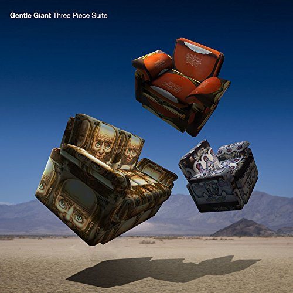

<!-- section break -->

1. The Steven Wilson Remixes
2. Giant
3. Nothing At All	
4. Why Not?	
5. Pantagruel's Nativity	
6. The House, The Street, The Room	
7. Schooldays	
8. Peel The Paint	
9. Mister Class And Quality?
10. Three Friends	
11. Freedom's Child	
12. Nothing At All (Steven Wilson 7" Edit)

<!-- section break -->

## Spotify


## Videos
### Gentle Giant - Giant (Official Lyric Video)
 

### More Videos

- [Three Friends (Steven Wilson Mix)](https://www.youtube.com/watch?v=TBWPlsVcd18)
- [Schooldays (Steven Wilson Mix)](https://www.youtube.com/watch?v=e9JzxQyYdWg)

## Release Information
|  Key           | Value                                                |
| ---------------| ---------------------------------------------------- |
| Release Year   | 2017                                   |
| Discogs Link   | [Gentle Giant - Three Piece Suite](https://www.discogs.com/release/10928571-Gentle-Giant-Three-Piece-Suite) |
| Label          | Alucard |
| Format         | Vinyl 2× LP Compilation (180g) |
| Catalog Number | ALUGGV058 |
| Notes | This collection features a selection of songs remixed by Steven Wilson from the first three albums, [m=15459], [m=15438], and [m=15551]. It also includes the rare track Freedoms Child previously released on [m=682954].   Made in EU |