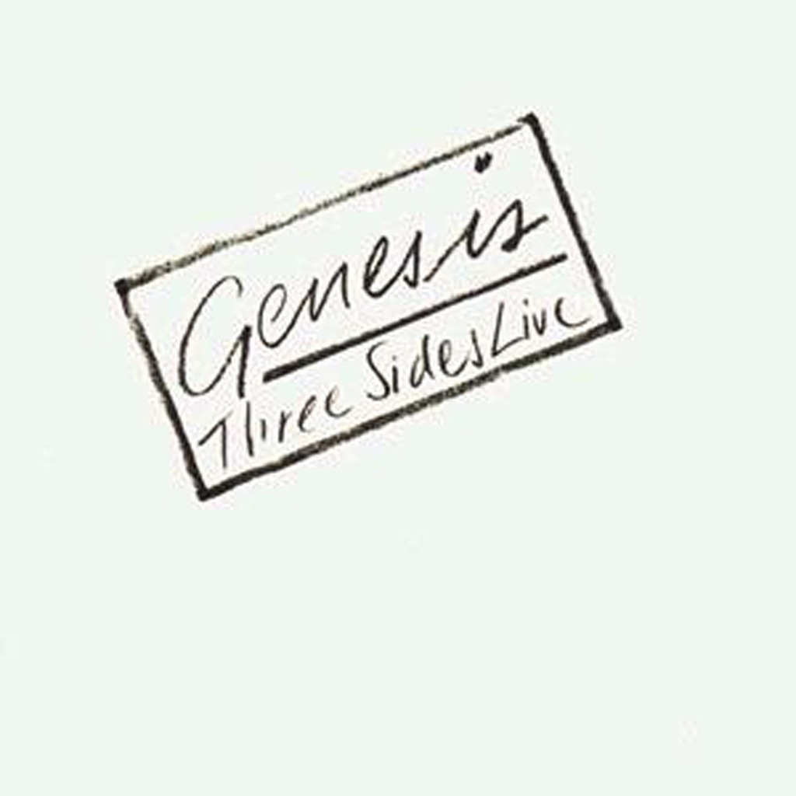

<!-- section break -->

1. Turn It On Again
2. Dodo
3. Abacab
4. Behind The Lines
5. Duchess
6. Me & Sarah Jane
7. Follow You, Follow Me
8. Misunderstanding
9. In The Cage (Medley - Cinema Show - Slippermen)
10. Afterglow
11. One For The Vine
12. Fountain Of Salmacis
13. It / Watcher Of The Skies

<!-- section break -->

## Spotify


## Release Information
|  Key           | Value                                                |
| ---------------| ---------------------------------------------------- |
| Release Year   | 1982                                   |
| Discogs Link   | [Genesis - Three Sides Live](https://www.discogs.com/release/1152731-Genesis-Three-Sides-Live) |
| Label          | Charisma |
| Format         | Vinyl 2× LP Album Stereo (Gatefold) |
| Catalog Number | GE 2002 |
| Notes | Recorded live in Europe and America during 1981 except B4, D1 and D2 1980 and D3 1976.  ⓟ & © 1982 Charisma Records Ltd.  This version has no mention of "Virgin" on it. Sold in Germany as "Four Sides Live" with an orange sticker saying "Four vier Seiten live" or with sticker "Four  Vier Seiten live  Limitierte Auflage"  |