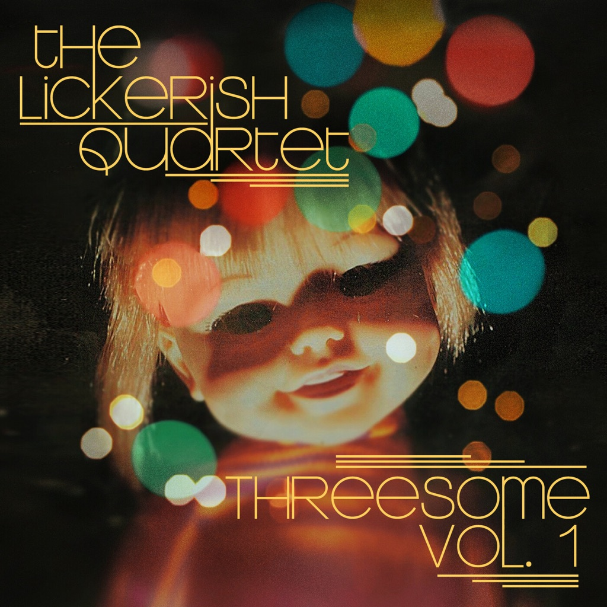

<!-- section break -->

1. Fadoodle
2. Bluebird's Blues
3. There Is A Magic Number
4. Lighthouse Spaceship
5. Fadoodle (Bonus Instrumental Version)
6. Bluebird's Blues (Bonus Instrumental Version)
7. There Is A Magic Number (Bonus Instrumental Version)
8. Lighthouse Spaceship (Bonus Instrumental Version)

<!-- section break -->

## Spotify


## Videos
### The Lickerish Quartet - Lighthouse Spaceship Lyric Video
 

### More Videos

- [The Lickerish Quartet - Fadoodle Lyric Video [Mono Mix]](https://www.youtube.com/watch?v=ImYKSTJsf-Q)
- [The Lickerish Quartet - Bluebirds Blues [Tuneling Video]](https://www.youtube.com/watch?v=301_ImeJu5A)
- [There Is a Magic Number](https://www.youtube.com/watch?v=idfAFwmsmDg)

## Release Information
|  Key           | Value                                                |
| ---------------| ---------------------------------------------------- |
| Release Year   | 2020                                   |
| Discogs Link   | [The Lickerish Quartet - Threesome Vol. 1](https://www.discogs.com/release/15551347-The-Lickerish-Quartet-Threesome-Vol-1) |
| Label          | Label Logic |
| Format         | Vinyl 12" 33 ⅓ RPM EP Remastered Stereo (Random Color) |
| Catalog Number | none |
| Notes | "Bonus Instrumental Version" per each Side B track title, printed on the reverse of the EP cover - "Instrumental Version" printed on the label on Side B.  According to album release website, "The color of vinyl you receive will be randomly chosen".  B-side instrumental versions unique to the vinyl edition. No catalog number, no text on spine. Includes printed inner sleeve. |