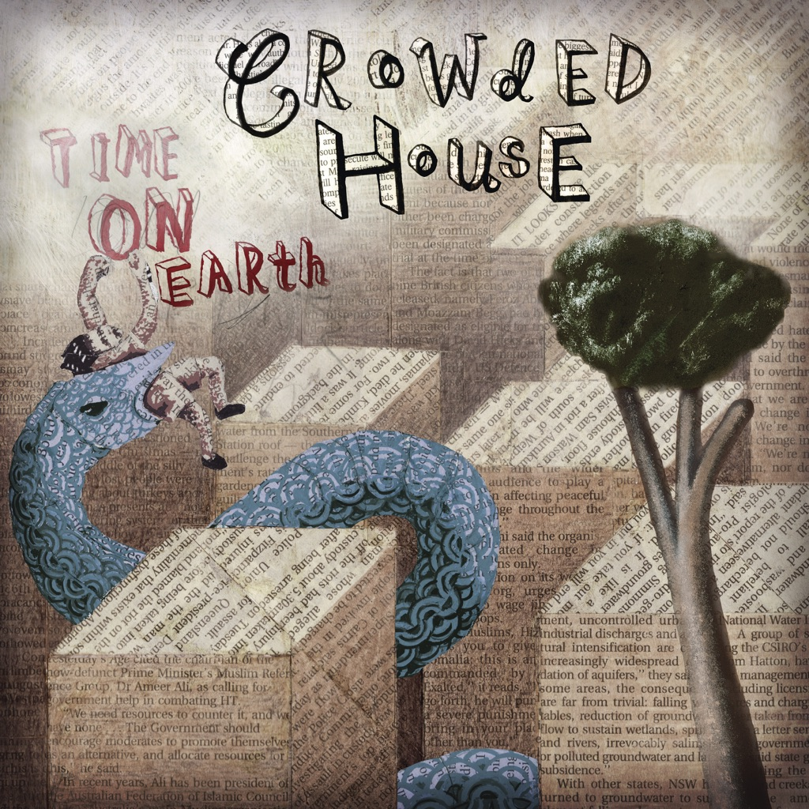

<!-- section break -->

1. Nobody Wants To (4:10)
2. Don't Stop Now (3:54)
3. She Called Up (2:53)
4. Say That Again (5:20)
5. Pour Le Monde (5:09)
6. Even A Child (3:57)
7. Heaven That I'm Making (3:55)
8. Stare Me Out (4:17)
9. A Sigh (3:14)
10. Silent House (5:52)
11. English Trees (3:41)
12. Lost Island (3:17)
13. Walked Her Way Down (4:15)
14. Transit Lounge (4:22)
15. You Are The Only One To Make Me Cry (3:41)
16. People Are Like Suns (3:53)

<!-- section break -->

## Spotify


## Videos
### Crowded House - Don't Stop Now
 

## Release Information
|  Key           | Value                                                |
| ---------------| ---------------------------------------------------- |
| Release Year   | 2007                                   |
| Discogs Link   | [Crowded House - Time On Earth](https://www.discogs.com/release/5536618-Crowded-House-Time-On-Earth) |
| Label          | Parlophone |
| Format         | Vinyl 2× LP Album Limited Edition |
| Catalog Number | 396 0271 |
| Notes | European double 180gm vinyl edition in custom stickered gatefold lyric sleeve with picture inner sleeves - features 16 tracks; B4 and C4 appear only on the LP. |