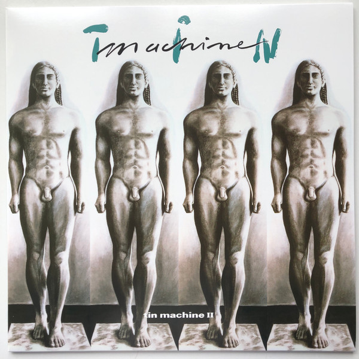

<!-- section break -->

1. Baby Universal (3:18)
2. One Shot (5:11)
3. You Belong In Rock N' Roll (4:07)
4. If There Is Something (4:45)
5. Amlapura (3:46)
6. Betty Wrong (3:48)
7. You Can't Talk (3:09)
8. Stateside (5:38)
9. Shopping For Girls (3:44)
10. A Big Hurt (3:40)
11. Sorry (3:29)
12. Goodbye Mr. Ed (3:24)
13. Hammerhead (0:58)

<!-- section break -->

## Videos
### Tin Machine - Baby Universal (music video version)
 

### More Videos

- [Tin Machine - If There Is Something](https://www.youtube.com/watch?v=c7QYO-1IQ3I)
- [David Bowie & Tin Machine - Amlapura](https://www.youtube.com/watch?v=2qCXUldOf1s)
- [Tin machine you belong in Rock n Roll](https://www.youtube.com/watch?v=Ok5A8VoOMis)
- [Tin Machine - One Shot](https://www.youtube.com/watch?v=esu90pt3aTo)

## Release Information
|  Key           | Value                                                |
| ---------------| ---------------------------------------------------- |
| Release Year   | 2020                                   |
| Discogs Link   | [Tin Machine - Tin Machine II](https://www.discogs.com/release/15628321-Tin-Machine-Tin-Machine-II) |
| Label          | Music On Vinyl |
| Format         | Vinyl LP Album Limited Edition Numbered Reissue Stereo (Silver, 180g) |
| Catalog Number | MOVLP2715 |
| Notes | Originally released ℗ © 1991 Tin Machine.  Numbered edition of 10.000 copies on silver coloured vinyl. Individual numbers embossed in silver on rear cover. Due to manufacturing variability, some copies appear blue-green instead of silver. But these are not marketed separately and have the standard hype sticker for this silver version.  Track B7 is unlisted.  Includes insert.  Special spot varnished sleeve.  Hype sticker front cover in gold. |