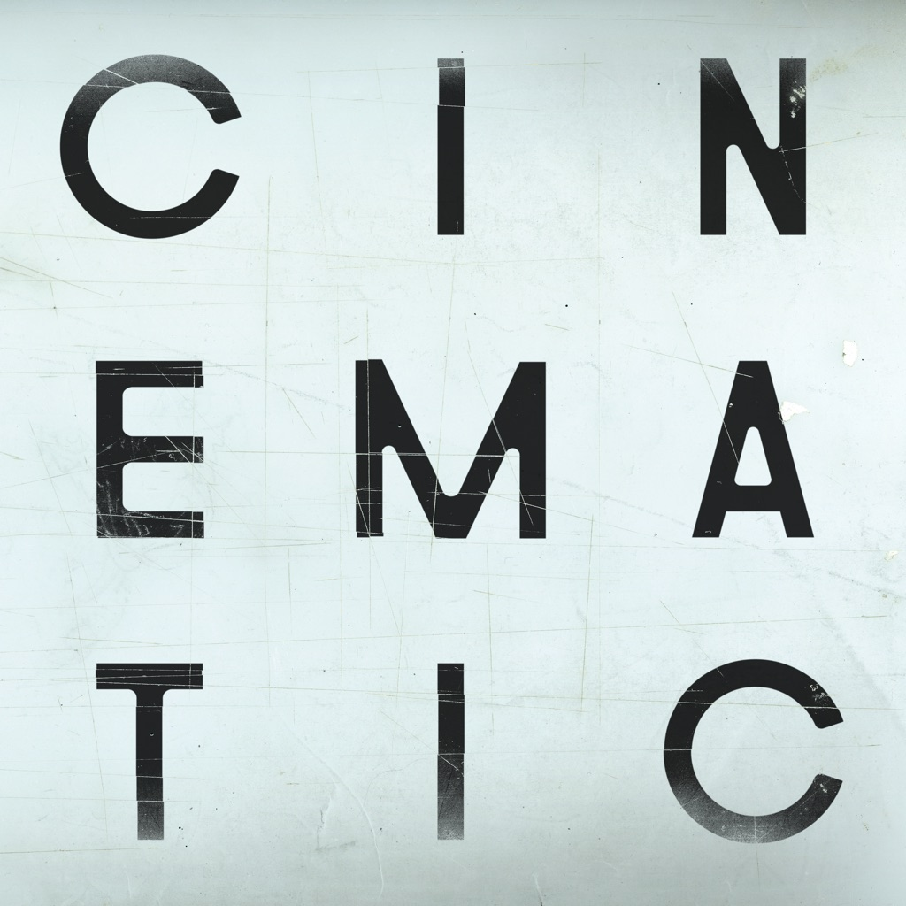

<!-- section break -->

1. To Believe
2. A Caged Bird / Imitations Of Life
3. Lessons
4. Wait for Now / Leave The World
5. The Workers of Art
6. Zero One / This Fantasy
7. A Promise

<!-- section break -->

## Spotify


## Videos
### The Cinematic Orchestra - The Workers of Art
 

### More Videos

- [The Cinematic Orchestra - 'To Believe feat. Moses Sumney'](https://www.youtube.com/watch?v=e7q4sgupsZc)
- [The Cinematic Orchestra - A Promise (feat. Heidi Vogel) (Edit)](https://www.youtube.com/watch?v=RmhITY04XRA)
- [The Cinematic Orchestra - A Caged Bird/Imitations of Life (feat. Roots Manuva)](https://www.youtube.com/watch?v=o-aH1qXU67I)
- [The Cinematic Orchestra - 'To Believe feat  Moses Sumney'](https://www.youtube.com/watch?v=1UrI94XojRs)
- [The Cinematic Orchestra - Wait For Now/Leave The World (feat. Tawiah)](https://www.youtube.com/watch?v=1iPVvexTouo)
- [The Cinematic Orchestra - Zero One/This Fantasy (feat. Grey Reverend)](https://www.youtube.com/watch?v=NZNLwgAPIgo)
- [The Cinematic Orchestra - Lessons](https://www.youtube.com/watch?v=9od_Cm-XD-g)
- [The Cinematic Orchestra - A Promise (feat. Heidi Vogel)](https://www.youtube.com/watch?v=K0ks9CBYDiM)

## Release Information
|  Key           | Value                                                |
| ---------------| ---------------------------------------------------- |
| Release Year   | 2019                                   |
| Discogs Link   | [The Cinematic Orchestra - To Believe](https://www.discogs.com/release/13344503-Cinematic-Orchestra-To-Believe) |
| Label          | Ninja Tune |
| Format         | Vinyl LP (White, 180 Gram), Vinyl LP (Clear, 180 Gram), All Media Album Deluxe Edition |
| Catalog Number | ZEN226X |
| Notes | Includes download code.  Pre-orders from Bleep.com came with double-sided poster/print and sticker. |