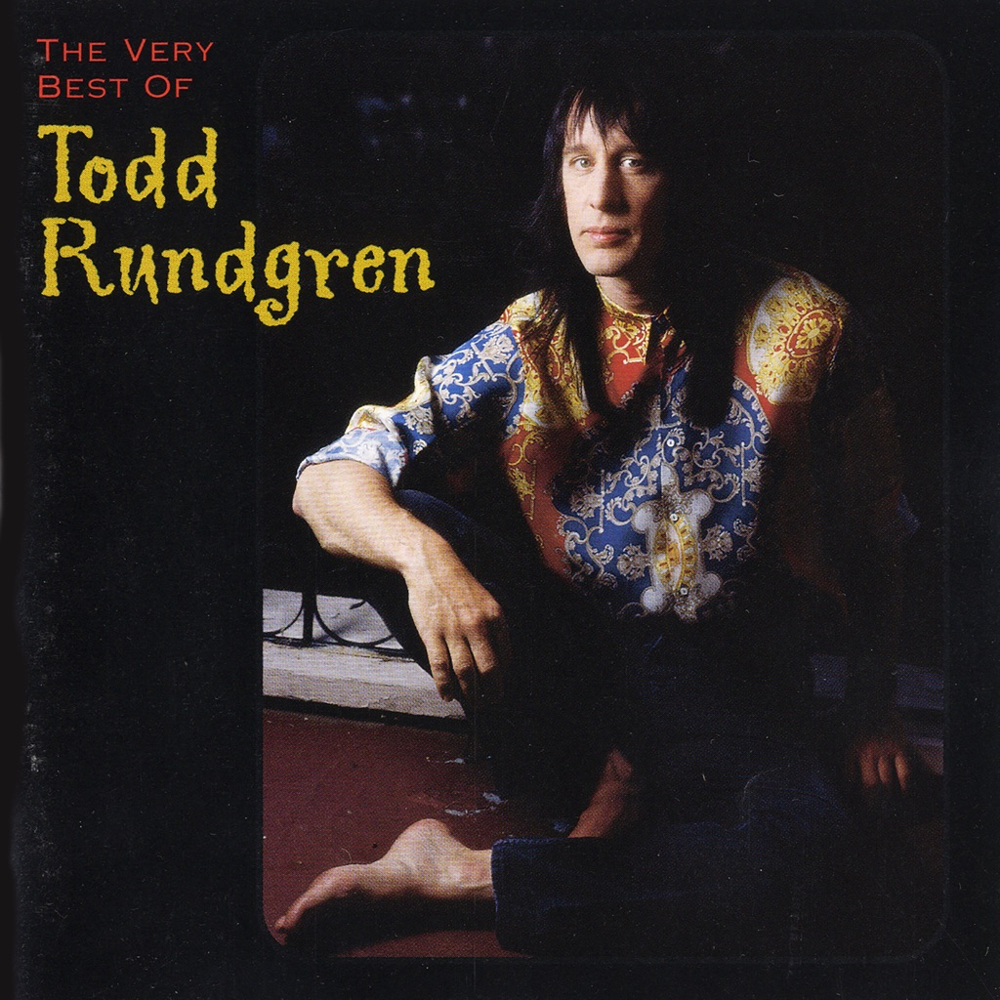

<!-- section break -->

1. How About A Little Fanfare? (0:57)
2. I Think You Know (3:48)
3. The Spark Of Life (6:43)
4. An Elpee's Worth Of Toons (2:08)
5. A Dream Goes On Forever (2:21)
6. Lord Chancellor's Nightmare Song (3:30)
7. Drunken Blue Rooster (3:00)
8. The Last Ride (4:46)
9. Everybody's Going To Heaven / King Kong Reggae (6:35)
10. Number 1 Lowest Common Denominator (5:10)
11. Useless Begging (3:27)
12. Sidewalk Cafe (2:25)
13. Izzat Love? (1:56)
14. Heavy Metal Kids (4:13)
15. In And Out The Chakras We Go (Formerly:  Shaft Goes To Outer Space) (5:48)
16. Don't You Ever Learn? (6:01)
17. Sons Of 1984 (4:37)

<!-- section break -->

## Spotify


## Videos
### Todd Rundgren - Todd (Full Album 1974)
 

## Release Information
|  Key           | Value                                                |
| ---------------| ---------------------------------------------------- |
| Release Year   | 1974                                   |
| Discogs Link   | [Todd Rundgren - Todd](https://www.discogs.com/release/380303-Todd-Rundgren-Todd) |
| Label          | Bearsville |
| Format         | Vinyl 2× LP Album |
| Catalog Number | 2 BR 6952 |
| Notes | First pressings came with a fold-out black and white poster with lyrics, credits, and names of buyers returning postcards enclosed in [m93839]. Original 1973 double LP album. The runouts are etched; STERLING is stamped. Cat# 2 BR 6952 on the cover and spine. Cat# 2BR 6952 on the labels. Tracks A1 to A5, B1 to D3: [l360084]/[l276311] Track A6: [l264963] Recorded at Secret Sound Studio. Sons of 1984: Recorded at Wollman Rink, Central Park by Bearsville Sound Remote Recording. |