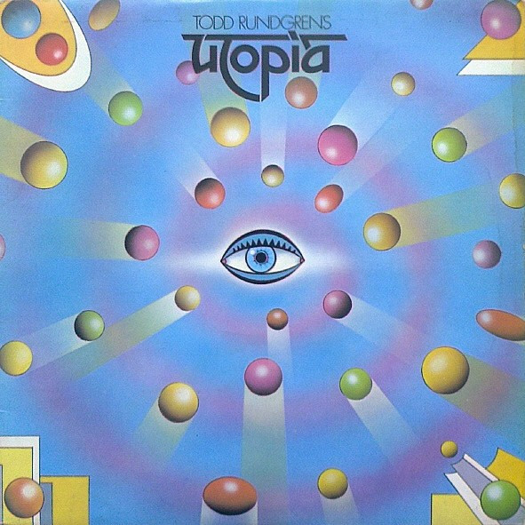

<!-- section break -->

1. Utopia (14:18)
2. Freak Parade (10:14)
3. Freedom Fighters (4:01)
4. The Ikon (30:22)

<!-- section break -->

## Videos
### Utopia - The Ikon [Full Song]
 

### More Videos

- [UTOPIA - Todd Rundgren's Utopia -- 1974](https://www.youtube.com/watch?v=CO0aqSBTVJk)
- [Todd Rundgren's Utopia - The Ikon central section](https://www.youtube.com/watch?v=iugdJ0vEaHw)
- [Todd Rundgren's Utopia - Freedom Fighters](https://www.youtube.com/watch?v=ZNHXQLWIpK4)
- [UTOPIA - Todd Rundgren's ---- 1974 --Promo](https://www.youtube.com/watch?v=YvoQKl00j1g)

## Release Information
|  Key           | Value                                                |
| ---------------| ---------------------------------------------------- |
| Release Year   | 1974                                   |
| Discogs Link   | [Utopia - Todd Rundgren's Utopia](https://www.discogs.com/release/1971194-Utopia-Todd-Rundgrens-Utopia) |
| Label          | Bearsville |
| Format         | Vinyl LP Album Stereo |
| Catalog Number | K55501 |
| Notes | Stamped runouts Lyrics printed on back sleeve. A Bearsville Recording distributed by WEA Records Ltd. ℗ & © 1974 All lyrics reproduced by kind permission of United Artists © 1974 |