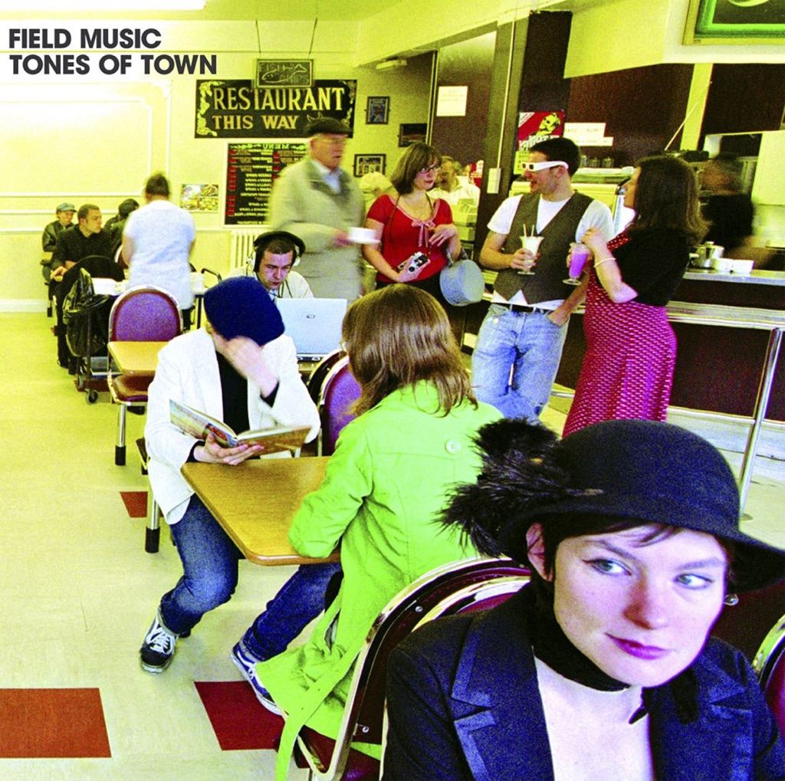

<!-- section break -->

1. Give It Lose It Take It (3:56)
2. Sit Tight (3:02)
3. Tones Of Town (3:05)
4. A House Is Not A Home (2:36)
5. Kingston (1:54)
6. Working To Work (2:51)
7. In Context (3:37)
8. A Gap Has Appeared (2:01)
9. Closer At Hand (2:29)
10. Place Yourself (3:02)
11. She Can Do What She Wants (3:06)

<!-- section break -->

## Spotify


## Videos
### Field Music - Tones of Town
 

### More Videos

- [Field Music - In Context](https://www.youtube.com/watch?v=DBqx9Tpmj-U)

## Release Information
|  Key           | Value                                                |
| ---------------| ---------------------------------------------------- |
| Release Year   | 2017                                   |
| Discogs Link   | [Field Music - Tones Of Town](https://www.discogs.com/release/10173938-Field-Music-Tones-Of-Town) |
| Label          | Memphis Industries |
| Format         | Vinyl LP Album Limited Edition Reissue (Yellow) |
| Catalog Number | MI074LPX |
| Notes | Released for Record Store Day 2017.  Back on LP for the first time since its original pressing in 2007, on limited edition of 650 on  180g yellow vinyl.  Includes download code.  Recorded at Eight Music Studio / Sunderland. Mastered at Alchemy.  Published by Chrysalis Music. ℗ + © Memphis Industries Ltd 2006. |