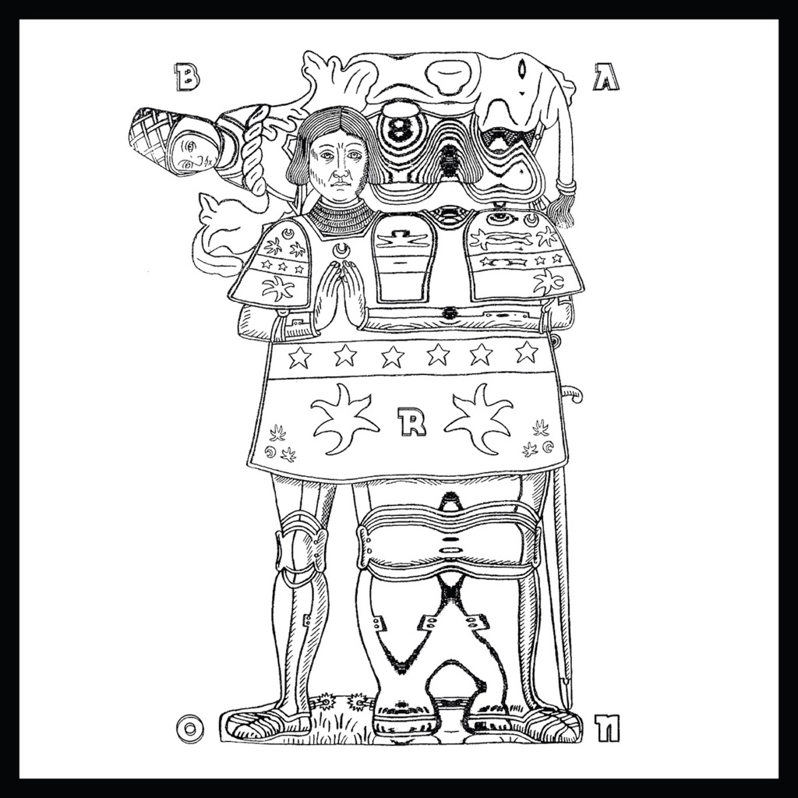

<!-- section break -->

1. Dragonfly (4:48)
2. Mark Maker (6:54)
3. Wild Cry (4:50)
4. Dark Down (3:25)
5. Stry (8:15)
6. Sleepless (7:05)
7. Deeper Align (6:52)
8. Albedo Dei (5:32)

<!-- section break -->

## Videos
### Baron - Mark Maker
 

### More Videos

- [Baron - Stry](https://www.youtube.com/watch?v=3sgJCOxKCfg)

## Release Information
|  Key           | Value                                                |
| ---------------| ---------------------------------------------------- |
| Release Year   | 2015                                   |
| Discogs Link   | [Baron - Torpor](https://www.discogs.com/release/7723184-Baron-Torpor) |
| Label          | Svart Records |
| Format         | Vinyl LP Album Limited Edition |
| Catalog Number | SVR338 |
| Notes | 500 copies made. including booklet insert with visionary-sleeve note-narrative by [a3049875] |