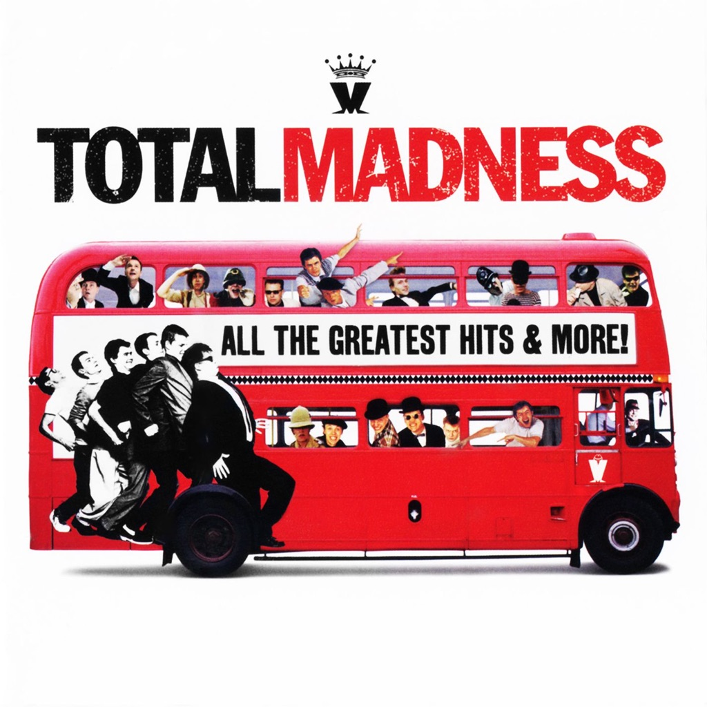

<!-- section break -->

1. One Step Beyond
2. Baggy Trousers
3. House Of Fun
4. Our House
5. Embarrassment
6. My Girl
7. It Must Be Love
8. Wings Of A Dove
9. The Sun And The Rain
10. Grey Day
11. NW5
12. Cardiac Arrest
13. Tomorrow's (Just Another Day)
14. Driving In My Car
15. Bed And Breakfast Man
16. Lovestruck
17. One Better Day
18. Michael Caine
19. Return Of The Los Palmas 7
20. The Prince
21. Shut Up
22. Madness
23. Night Boat To Cairo

<!-- section break -->

## Spotify


## Release Information
|  Key           | Value                                                |
| ---------------| ---------------------------------------------------- |
| Release Year   | 2017                                   |
| Discogs Link   | [Madness - Total Madness](https://www.discogs.com/release/9848793-Madness-Total-Madness) |
| Label          | Music On Vinyl |
| Format         | Vinyl 2× LP Compilation Limited Edition Numbered Reissue Repress (Red, 180 Gram) |
| Catalog Number | MOVLP629 |
| Notes | Limited edition of 2.000 numbered copies on red vinyl Gatefold Sleeve. Repressed from [r=4071815] master.  MOV 00[XXXX] [silver print on back sleeve]  This compilation ℗ and © 2012 Union Square Music Ltd. Made in the EU.  All tracks except side B, track 5: ℗ 2009 Stirling Holdings Limited, under exclusive licence to Union Square Music Ltd. Courtesy of Stirling Holdings Limited.  Hype stickers on cellophane bag:  "Britain's Favourite Band! Featuring Our House One Step Beyond Baggy Trousers It Must Be Love House Of Fun MOVLP629"  "Music On Vinyl Madness 'Total Madness' All Their Greatest Hits Limited Edition of 2000 Coloured Copies Individually Numbered 180 gram audiophile vinyl www.musiconvinyl.com MOVLP629"  |