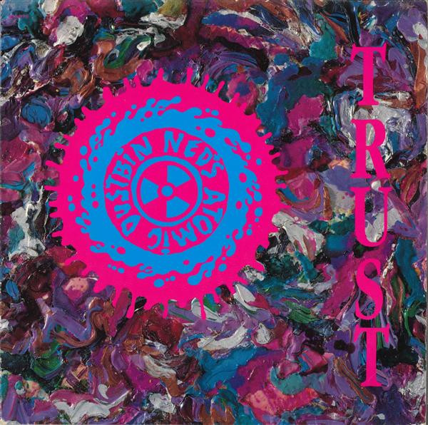

<!-- section break -->

1. Trust
2. Faceless
3. Titch

<!-- section break -->

## Videos
### Ned's Atomic Dustbin - Titch
 

### More Videos

- [Ned's Atomic Dustbin - Faceless HD](https://www.youtube.com/watch?v=-sbuANFW8qE)
- [Ned's Atomic Dustbin - Trust](https://www.youtube.com/watch?v=ieYfUDWKJjs)

## Release Information
|  Key           | Value                                                |
| ---------------| ---------------------------------------------------- |
| Release Year   | 1991                                   |
| Discogs Link   | [Ned's Atomic Dustbin - Trust](https://www.discogs.com/release/822769-Neds-Atomic-Dustbin-Trust) |
| Label          | Sony Soho Square |
| Format         | Vinyl 12" 45 RPM |
| Catalog Number | 657462 6 |
| Notes | Released with printed inner sleeve.    Recorded at Rockfield Studios, Gwent, in early July 1991.    Original sound recording made by Sony Music Entertainment (UK) Ltd.  ℗ © Sony Music Entertainment (UK) Ltd.  Distribution Sony Music.   |