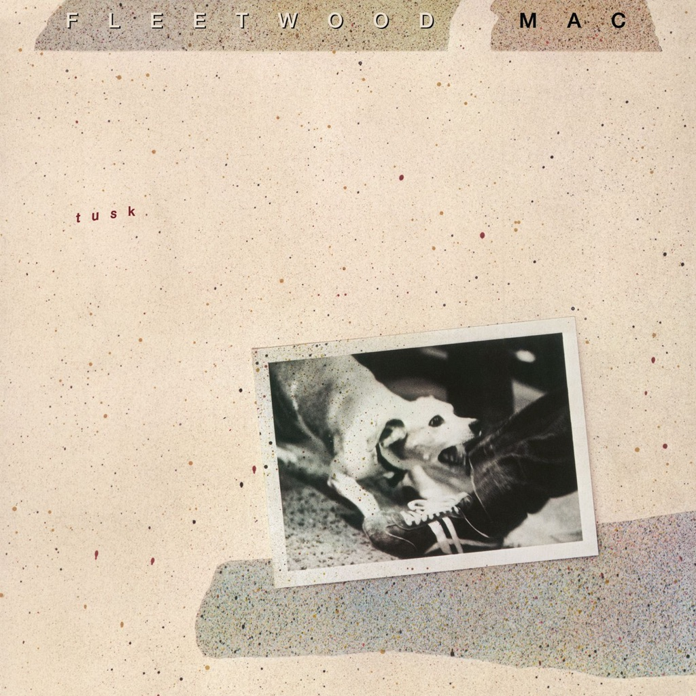

<!-- section break -->

1. Over & Over (4:35)
2. The Ledge (2:02)
3. Think About Me (2:44)
4. Save Me A Place (2:40)
5. Sara (6:26)
6. What Makes You Think You're The One (3:28)
7. Storms (5:28)
8. That's All For Everyone (3:04)
9. Not That Funny (3:19)
10. Sisters Of The Moon (4:36)
11. Angel (4:53)
12. That's Enough For Me (1:48)
13. Brown Eyes (4:27)
14. Never Make Me Cry (2:14)
15. I Know I'm Not Wrong (2:59)
16. Honey Hi (2:43)
17. Beautiful Child (5:19)
18. Walk A Thin Line (3:44)
19. Tusk (3:36)
20. Never Forget (3:40)

<!-- section break -->

## Spotify


## Release Information
|  Key           | Value                                                |
| ---------------| ---------------------------------------------------- |
| Release Year   | 2019                                   |
| Discogs Link   | [Fleetwood Mac - Tusk](https://www.discogs.com/release/14471233-Fleetwood-Mac-Tusk) |
| Label          | Warner Records |
| Format         | Vinyl 2× LP Album Reissue (Silver) |
| Catalog Number | RCV1 3350 |
| Notes | Reissue on silver coloured vinyl. Photo on front sleeve is embossed. Single pocket outer jacket with a pair of numbered inner sleeves for each disc. ℗ & © 1979 Warner Records Inc. Made in the E.U.  Some tracks recorded by Lindsey Buckingham at home. Mastered at Capitol Records.  Digital mix-down equipment furnished by Soundstream Inc.  The U.S.C. Trojan Marching Band appears on the song "Tusk" Recorded live at Dodger Stadium.  This album is dedicated to Wing Commander Fleetwood and to Morris Buckingham |