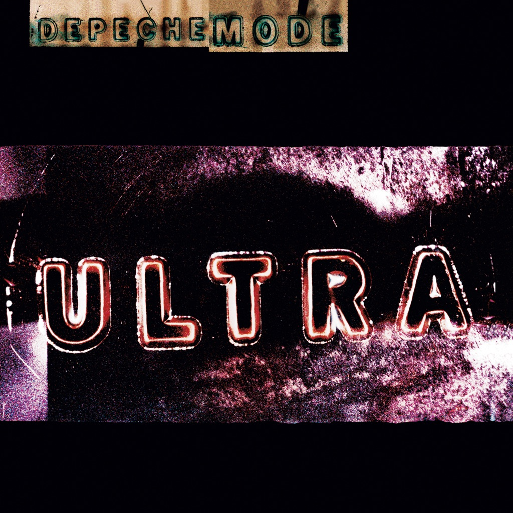

<!-- section break -->

1. Barrel Of A Gun
2. The Love Thieves
3. Home
4. It's No Good
5. Uselink
6. Useless
7. Sister Of Night
8. Jazz Thieves
9. Freestate
10. The Bottom Line
11. Insight

<!-- section break -->

## Spotify


## Release Information
|  Key           | Value                                                |
| ---------------| ---------------------------------------------------- |
| Release Year   | 2017                                   |
| Discogs Link   | [Depeche Mode - Ultra](https://www.discogs.com/release/9798755-Depeche-Mode-Ultra) |
| Label          | Sony Music |
| Format         | Vinyl LP Album Reissue (Gatefold) |
| Catalog Number | 88985336911 |
| Notes | © 1997 Venusnote Ltd. under exclusive license to Sony Music Entertainment International Ltd. ℗ 1997, 2016 Venusnote Ltd. under exclusive license to  Sony Music Entertainment International Ltd. / Distributed by Sony Music Entertainment. / All trademarks and logos are protected. / Made in the EU. / Sony Music Entertainment International Services GmbH, PO Box 510, 33311 Gütersloh, Germany. / LC 05834 / 88985336911.  |