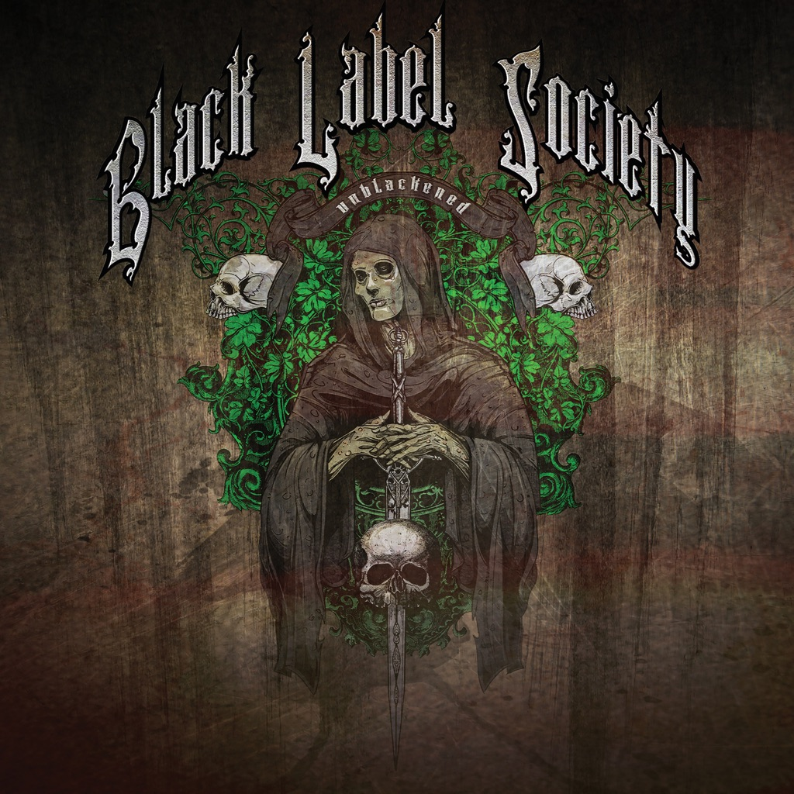

<!-- section break -->

1. Losin' Your Mind (5:47)
2. The Blessed Hellride (4:23)
3. Sold My Soul (7:36)
4. Road Back Home (6:10)
5. Spoke In The Wheel (5:17)
6. House Of Doom (4:22)
7. Queen Of Sorrow (3:48)
8. Machine Gun Man (4:51)
9. Sweet Jesus (4:38)
10. In This River (6:41)
11. Throwin' It All Away (11:07)
12. Takillya (Estyabon) (1:39)
13. Won't Find It Here (8:47)
14. Rust (5:27)
15. Speedball (1:05)
16. I Thank You Child (5:02)
17. Stillborn (8:25)
18. Ain't No Sunshine When She's Gone (3:31)
19. Lovin' Woman (5:05)
20. Queen Of Sorrow (Unplugged) (4:14)
21. Song For You (5:08)
22. Won't Find It Here (Unplugged) (6:55)
23. Yesterday, Today, Tomorrow (4:45)

<!-- section break -->

## Spotify


## Videos
### Yesterday, Today, Tomorrow- Black Label Society (Unblackened)
 

### More Videos

- [Sold My Soul - Black Label Society (Unblackened)](https://www.youtube.com/watch?v=PH8An0MFF2A)
- [Rust- Black Label Society (Unblackened)](https://www.youtube.com/watch?v=7FPkcpP9NWY)
- [In This River- Black Label Society (Unblackened)](https://www.youtube.com/watch?v=ZdYB4kq4_IU)
- [Losin' Your Mind- Black Label Society (Unblackened)](https://www.youtube.com/watch?v=8WOh9igfGv0)
- [Lovin' Woman- Black Label Society (Unblackened)](https://www.youtube.com/watch?v=EIGiWQy1A2w)
- [Throwin' it all Away-Black Label Society (Unblackened)](https://www.youtube.com/watch?v=55ofHYBDLNQ)
- [Stillborn-Black Label Society (Unblackened)](https://www.youtube.com/watch?v=FhdaThpugpI)

## Release Information
|  Key           | Value                                                |
| ---------------| ---------------------------------------------------- |
| Release Year   | 2013                                   |
| Discogs Link   | [Black Label Society - Unblackened](https://www.discogs.com/release/6224254-Black-Label-Society-Unblackened) |
| Label          | Vinyl Vault |
| Format         | Vinyl 3× LP Album Limited Edition (Clear) |
| Catalog Number | VV3LP011 |
| Notes | Vinyl Vault is proud to present Unblackened, the new live album from Zack Wylde’s legendary heavy rock outfit Black Label Society recorded in 2013 at Los Angeles’ Club Nokia. BLS present their songs in a way never heard before, with greater use of acoustic instrumentation and a stripped down approach that will leave you floored by the subtlety and intricacies of their songwriting. Despite this the band retain their intensity and lose none of their power with stinging, searing solos that fans know and love featuring throughout on classics such as ‘Stillborn, ‘The Blessed Hellride’ and ‘Throwin’ It All Away’.   This 3LP set also features six additional tracks not found on the DVD concert release including two acoustic versions of “Queen Of Sorrow” and “Won’t Find It Here,” and covers of Leon Russel’s “Song For You” and “Aint No Sunshine” by Bill Withers.   |