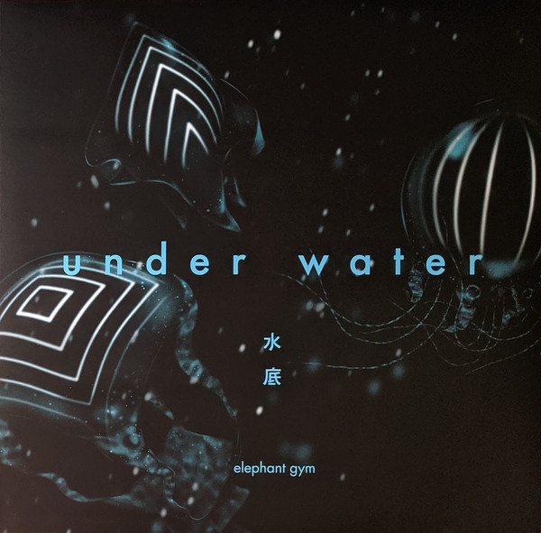

<!-- section break -->

1. Shower
2. Underwater
3. Satellite
4. Half Asleep
5. Bad Dream
6. Half
7. Shell
8. Lake
9. Quilt
10. Walk
11. Speechless
12. Moonset
13. Midway [Rgry Remix]

<!-- section break -->

## Spotify


## Videos
### Elephant Gym - Underwater - Full Album - 2018
 

## Release Information
|  Key           | Value                                                |
| ---------------| ---------------------------------------------------- |
| Release Year   | 2019                                   |
| Discogs Link   | [Elephant Gym - Underwater](https://www.discogs.com/release/13413825-Elephant-Gym-Underwater) |
| Label          | Topshelf Records (2) |
| Format         | Vinyl LP Limited Edition (Dark Blue In Mint) |
| Catalog Number | Eg-0017/TSR-201 |
| Notes | Record housed in a single jacket with paper inner sleeve.  Limited to 350 copies. Includes a foldout lyric sheet insert. |