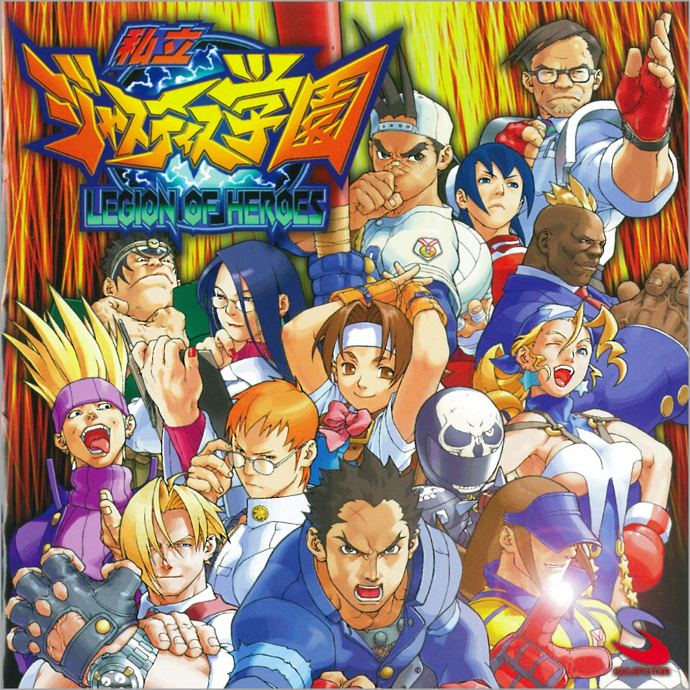

<!-- section break -->

1. Travel By Telephone (2:47)
2. Everything Has Its Point (3:21)
3. High Acetate (1:53)
4. Undercovers On (5:31)
5. Good Things (3:43)
6. Used For Glue (3:18)
7. World Invitational (3:35)
8. The Switch (3:04)
9. Holding Sand (3:43)
10. My Echo (1:59)
11. Favorite Star (2:59)
12. So Down On (3:20)
13. Hooligans For Life (2:26)

<!-- section break -->

## Spotify


## Videos
### Rival Schools - Good Things
 

### More Videos

- [Rival Schools - Used For Glue](https://www.youtube.com/watch?v=DcRt7kkzcxM)

## Release Information
|  Key           | Value                                                |
| ---------------| ---------------------------------------------------- |
| Release Year   | 2022                                   |
| Discogs Link   | [Rival Schools - United By Fate](https://www.discogs.com/release/24976549-Rival-Schools-United-By-Fate) |
| Label          | Run For Cover Records (2) |
| Format         | Vinyl LP Album Reissue (Blue Inside White) |
| Catalog Number | RFC:242 |
| Notes | Blue in White / 300 (Rough Trade Exclusive). |