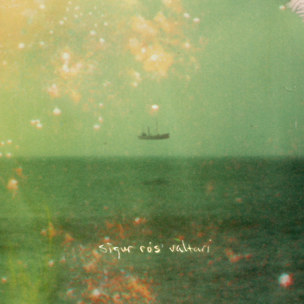

<!-- section break -->

1. Ég Anda
2. Ekki Múkk
3. Varúð
4. Rembihnútur
5. Dauðalogn
6. Varðeldur
7. Valtari
8. Fjögur Píanó

<!-- section break -->

## Spotify


## Videos
### Sigur Rós - Varúð [Official Music Video]
 

### More Videos

- [Sigur Rós - Valtari [Full Album Stream]](https://www.youtube.com/watch?v=jQi77xni1p8)

## Release Information
|  Key           | Value                                                |
| ---------------| ---------------------------------------------------- |
| Release Year   | 2021                                   |
| Discogs Link   | [Sigur Rós - Valtari](https://www.discogs.com/release/19148089-Sigur-R%C3%B3s-Valtari) |
| Label          | Krúnk |
| Format         | Vinyl 2× LP Album Reissue |
| Catalog Number | KRUNK61LP |
| Notes | Limited standard black vinyl edition. Side B runout is a locked groove.  Barcode sticker on shrink, lower right corner.  ℗ 2012 the copyright in this sound recording is owned by Sigur Rós under exclusive license to Krúnk.  © 2021 Krúnk. Published by Universal Music Publishing. |