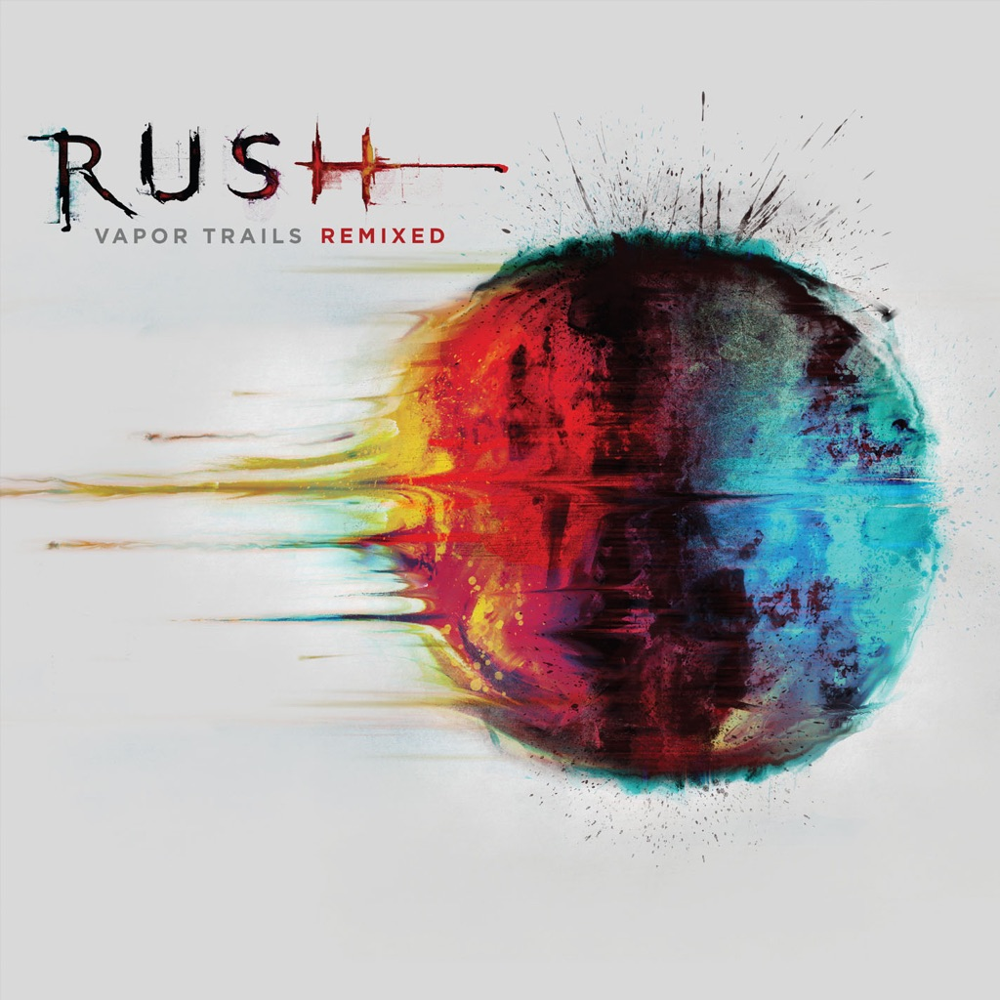

<!-- section break -->

1. One Little Victory (5:09)
2. Ceiling Unlimited (5:28)
3. Ghost Rider (5:42)
4. Peaceable Kingdom (5:23)
5. The Stars Look Down (4:29)
6. How It Is (4:06)
7. Vapor Trail (4:58)
8. Secret Touch (6:35)
9. Earthshine (5:38)
10. Sweet Miracle (3:41)
11. Nocturne (4:49)
12. Freeze - Part IV Of "Fear" (6:22)
13. Out Of The Cradle (5:04)

<!-- section break -->

## Release Information
|  Key           | Value                                                |
| ---------------| ---------------------------------------------------- |
| Release Year   | 2013                                   |
| Discogs Link   | [Rush - Vapor Trails Remixed](https://www.discogs.com/release/5005939-Rush-Vapor-Trails-Remixed) |
| Label          | Atlantic |
| Format         | Vinyl 2× LP Album Reissue (180 Gram) |
| Catalog Number | 8122796441 |
| Notes | Recorded at Reaction Studios, Toronto, January to November, 2001 © 2002 Core Music Publishing (SOCAN) ℗ & © 2013 Atlantic Recording Corporation & Anthem Entertainment.  Single sleeve with two-sided insert.  EU version of this release pressed at Optimal Media GmbH in Germany.  Matrix runouts include matrix numbers for RTI ([l66254]) which suggests that plating was done there.  Printed in E.U. (on labels and sleeve).  Runouts are etched except for "MASTERDISK" which is stamped. |