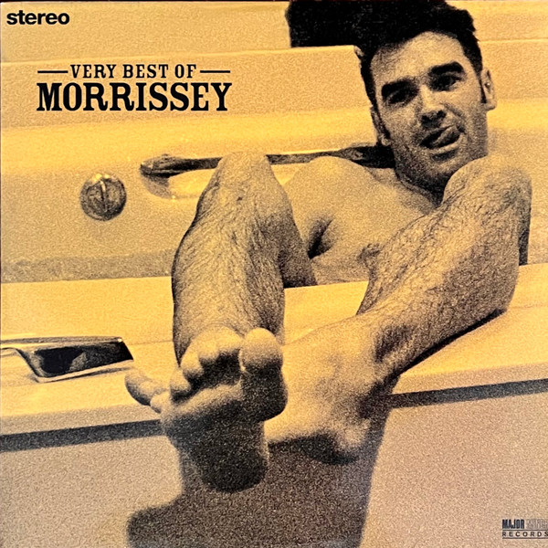

<!-- section break -->

1. The Last Of The Famous International Playboys
2. You're Gonna Need Someone On Your Side
3. The More You Ignore Me, The Closer I Get
4. Glamorous Glue
5. Girl Least Likely To
6. Suedehead
7. Tomorrow
8. Boxers
9. My Love Life
10. Break Up The Family
11. I've Changed My Plea To Guilty
12. Such A Little Thing Makes Such A Big Difference
13. Ouija Board, Ouija Board
14. Interesting Drug
15. November Spawned A Monster
16. Everyday Is Like Sunday
17. Interlude
18. Moonriver

<!-- section break -->

## Spotify


## Videos
### Morrissey - Boxers - Vinyl
 

### More Videos

- [Morrissey - Glamorous Glue](https://www.youtube.com/watch?v=80sbKxPXzKw)
- [Morrissey - The Last Of The Famous International Playboys](https://www.youtube.com/watch?v=Bk1wUKoXL20)
- [Morrissey - Sunny](https://www.youtube.com/watch?v=wHqnBTZbuno)
- [🔴 Morrissey ‎– Complete A Side [ Very Best Of LP 10th Anniversary ]](https://www.youtube.com/watch?v=vLNDN6ltNxQ)
- [Morrissey - Boxers](https://www.youtube.com/watch?v=UANBdod8Nuk)
- [Morrissey - My Love Life](https://www.youtube.com/watch?v=WiUZYLm3CqA)
- [🔴 Morrissey ‎– Complete B Side [ Very Best Of LP 10th Anniversary ]](https://www.youtube.com/watch?v=5yUA2u0WUnc)
- [🔴 Morrissey ‎– Complete C Side [ Very Best Of LP 10th Anniversary ]](https://www.youtube.com/watch?v=Xcu1Bs1PxSA)
- [Morrissey - Tomorrow](https://www.youtube.com/watch?v=vDdQcfz6pbo)

## Release Information
|  Key           | Value                                                |
| ---------------| ---------------------------------------------------- |
| Release Year   | 2011                                   |
| Discogs Link   | [Morrissey - Very Best Of](https://www.discogs.com/release/2852539-Morrissey-Very-Best-Of) |
| Label          | Major Minor |
| Format         | Vinyl 2× LP Compilation Remastered |
| Catalog Number | SMLP71 |
| Notes | Digitally Remastered | File Under Popular  This version of Interlude is previously unreleased.  Very similar to the 2016 reissue ([r=10082664]) in which the copyrights are not owned by EMI Records Ltd. but by Parlophone Records Ltd.  Songwriter credits are listed on inner-sleeves with tracks 1 to 19, whereas the producers are listed with side and track number for each side. Credit is given for "Gatefold Photographer" but this 2 LP-set comes in a single pocket wide-spine sleeve with inner sleeves. The inner sleeves configure to make one image.  Runouts: 'BB30418-01 A/B/C/D1 MK' stamped, remainder etched  Some copies included a hype sticker: "180 Gram * Limited Edition Classic LP * High-Definition Premium Virgin Vinyl Pressing for Super Fidelity * The Nicest Thing You Can Do For Your Stylus And Your Ears The Ultimate Record: The Way Music Was Meant To Be Heard And Great Enough For An Audiophile" |