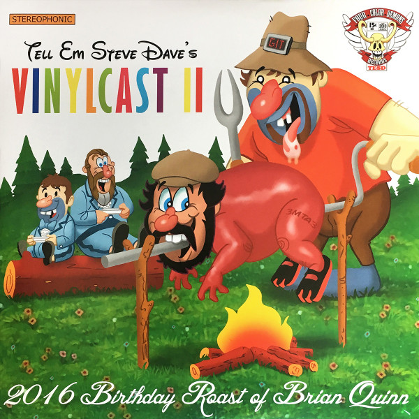

<!-- section break -->

1. Opening Ceremonies
2. Jsarge's symphony in Q
3. A who's who
4. Owen Benjamin
5. Ming the Merciless
6. Joe Gatto
7. Git 'em
8. Ian "EK" Morris
9. Sunday Jeff
10. Doug Stanhope
11. Maxwell
12. Sal Vulcano
13. Mikey Z
14. Chris "Roast Pussy" Laudando
15. Walt
16. Bry
17. Justin Roiland
18. Q
19. Faccia Bella

<!-- section break -->

## Release Information
|  Key           | Value                                                |
| ---------------| ---------------------------------------------------- |
| Release Year   | 2016                                   |
| Discogs Link   | [Tell 'Em Steve-Dave - Vinylcast II 2016 Birthday Roast of Brian Quinn](https://www.discogs.com/release/9173624-Tell-Em-Steve-Dave-Vinylcast-II-2016-Birthday-Roast-of-Brian-Quinn) |
| Label          | Four Color Demons Records |
| Format         | Vinyl 2× LP Album Stereo |
| Catalog Number | none |
| Notes | First pressing as denoted by the matrix runouts. The first 350 orders came with a limited edition swatch of felt "taken from the poker table where over 300+ Tell 'Em Steve-Dave podcasts were recorded." The first pieces of felt were mistakenly mailed without a written number. |