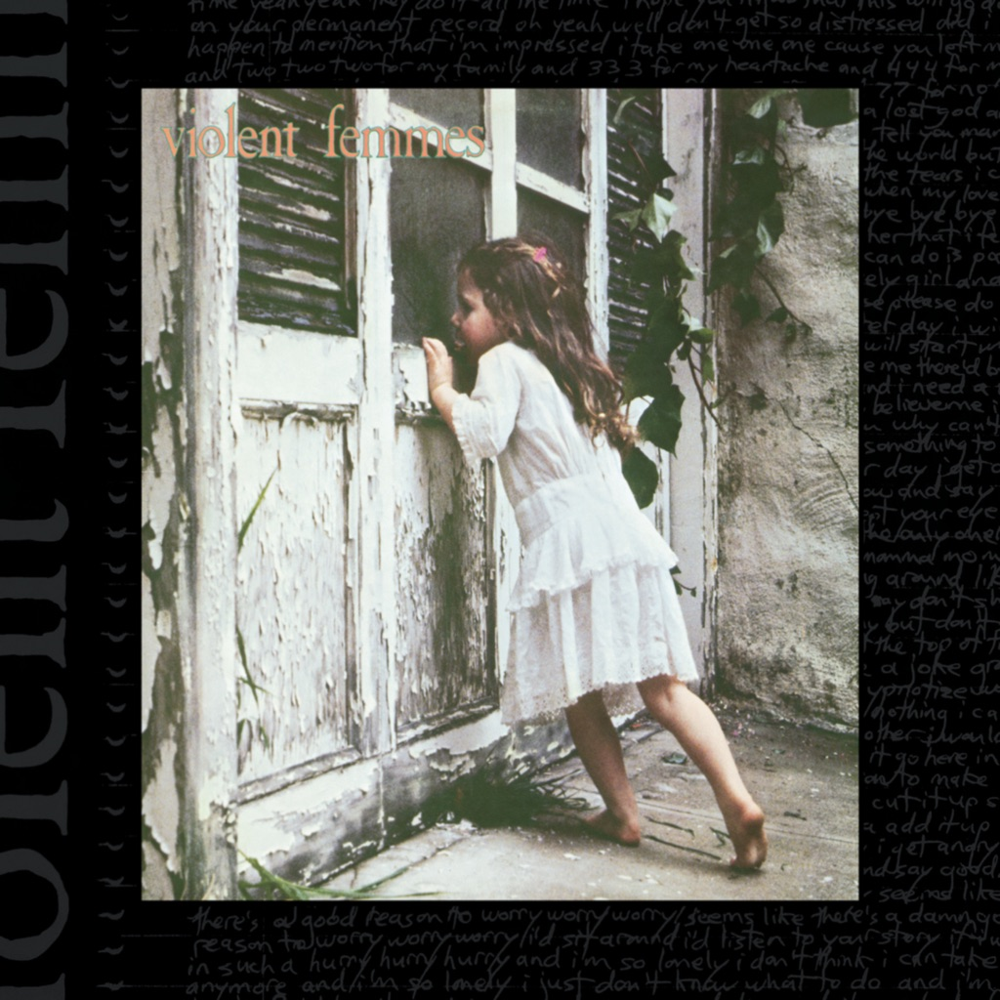

<!-- section break -->

1. Blister In The Sun (2:23)
2. Kiss Off (2:53)
3. Please Do Not Go (4:15)
4. Add It Up (4:44)
5. Confessions (5:27)
6. Prove My Love (2:37)
7. Promise (2:48)
8. To The Kill (3:59)
9. Gone Daddy Gone/I Just Want To Make Love To You (3:03)
10. Good Feeling (3:49)

<!-- section break -->

## Spotify


## Videos
### Violent Femmes - Full Album (1982)
 

## Release Information
|  Key           | Value                                                |
| ---------------| ---------------------------------------------------- |
| Release Year   | 2018                                   |
| Discogs Link   | [Violent Femmes - Violent Femmes](https://www.discogs.com/release/12101265-Violent-Femmes-Violent-Femmes) |
| Label          | Craft Recordings |
| Format         | Vinyl LP Album Reissue Remastered (180 Gram) |
| Catalog Number | CR00108 |
| Notes | 180-Gram 35th Anniversary Reissue  Mastered at Capitol Mastering  Recorded at Castle Recording Company,  Lake Geneva, Wisconsin, July 1982.   Thanks to Robert Munger, Bryan King, 4TA and The Bone.  Special thanks to our friends who are no longer with us, James and Christina.  Originally released as [r=426356] (Jan 1982).  Track B4 has an altered title to previous releases.  |