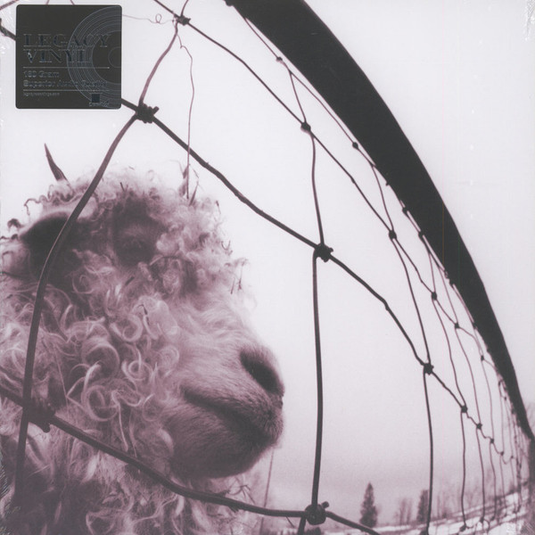

<!-- section break -->

1. Go
2. Animal
3. Daughter
4. Glorified G
5. Dissident
6. W.M.A.
7. Blood
8. Rearviewmirror
9. Rats
10. Elderly Woman Behind The Counter In A Small Town
11. Leash
12. Indifference

<!-- section break -->

## Spotify


## Videos
### Rats (Remastered)
 

### More Videos

- [Go (Remastered)](https://www.youtube.com/watch?v=gBt8DnKC1_Y)
- [Rearviewmirror (Remastered)](https://www.youtube.com/watch?v=bf2LDmkzmwo)
- [Animal (Remastered)](https://www.youtube.com/watch?v=vR7OWzvf5uM)
- [Dissident (Remastered)](https://www.youtube.com/watch?v=4cpJ982JGOo)
- [W.M.A. (Remastered)](https://www.youtube.com/watch?v=Q2bZS_nPPNA)
- [Indifference (Remastered)](https://www.youtube.com/watch?v=vZCMgm6Z-8M)
- [Pearl Jam - Daughter HQ](https://www.youtube.com/watch?v=uG6YjrtzPFg)
- [Glorified G (Remastered)](https://www.youtube.com/watch?v=CyPMgPa6RbE)
- [Blood (Remastered)](https://www.youtube.com/watch?v=p84QQvrL74s)
- [Leash (Remastered)](https://www.youtube.com/watch?v=x3pRrMz_Uqk)
- [Pearl Jam - Elderly Woman Behind the Counter in a Small Town (Official Audio)](https://www.youtube.com/watch?v=4YFYNUu_sqE)

## Release Information
|  Key           | Value                                                |
| ---------------| ---------------------------------------------------- |
| Release Year   | 2016                                   |
| Discogs Link   | [Pearl Jam - Vs.](https://www.discogs.com/release/8354355-Pearl-Jam-Vs) |
| Label          | Sony Music |
| Format         | Vinyl LP Album Reissue Remastered (180 Gram, Gatefold ) |
| Catalog Number | 88697843131 |
| Notes | Issued in a gatefold sleeve, includes an insert with lyrics & credits.   |