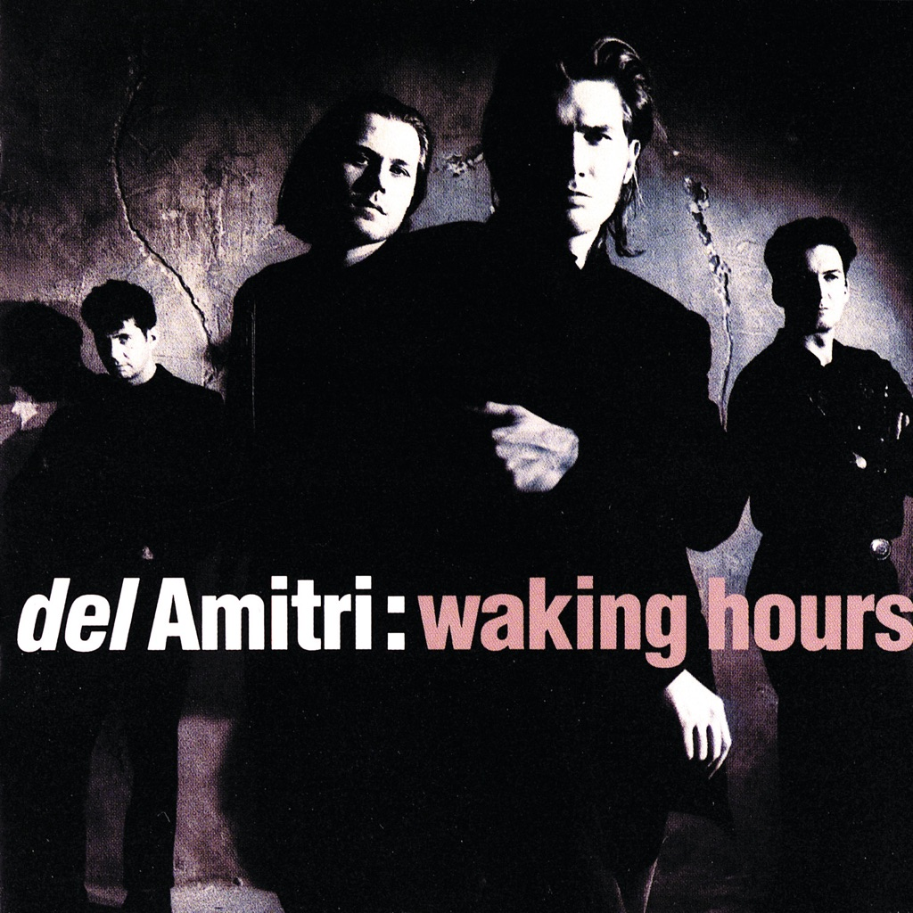

<!-- section break -->

1. Kiss This Thing Goodbye
2. Opposite View
3. Move Away Jimmy Blue
4. Stone Cold Sober
5. You're Gone
6. When I Want You
7. This Side Of The Morning
8. Empty
9. Hatful Of Rain
10. Nothing Ever Happens

<!-- section break -->

## Spotify


## Videos
### Del Amitri - Kiss This Thing Goodbye
 

### More Videos

- [Del Amitri - Nothing ever happens (James Whale show)](https://www.youtube.com/watch?v=ModyRm-6uNo)

## Release Information
|  Key           | Value                                                |
| ---------------| ---------------------------------------------------- |
| Release Year   | 1989                                   |
| Discogs Link   | [Del Amitri - Waking Hours](https://www.discogs.com/release/418269-Del-Amitri-Waking-Hours) |
| Label          | A&M Records |
| Format         | Vinyl LP Album |
| Catalog Number | AMA 9006 |
| Notes | ℗ 1989 A&M Records Ltd Reproduction prohibited © 1989 A&M Records Ltd, all rights reserved First pressing of album circa 1989. Released with a printed inner sleeve (lyrics on one side, credits and collage of photos/memorabilia on reverse). |