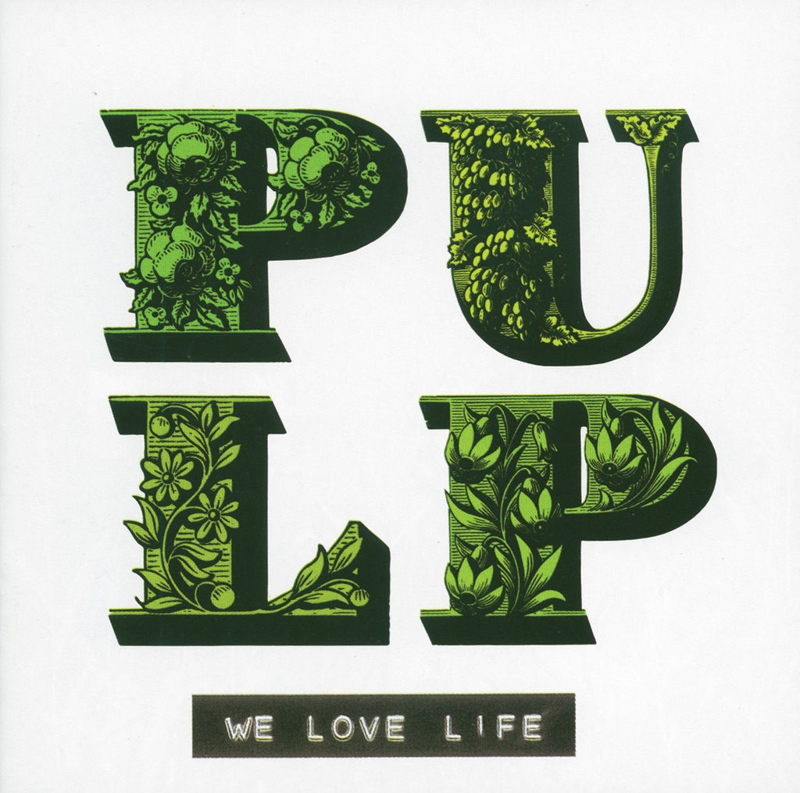

<!-- section break -->

1. Weeds
2. Weeds II (The Origin Of The Species)
3. The Night That Minnie Timperley Died
4. The Trees
5. Wickerman
6. I Love Life
7. The Birds In Your Garden
8. Bob Lind (The Only Way Is Down)
9. Bad Cover Version
10. Roadkill
11. Sunrise

<!-- section break -->

## Spotify


## Videos
### PULP - Weeds II (The Origin Of The Species)
 

### More Videos

- [Weeds](https://www.youtube.com/watch?v=kpdcSgqIsVc)
- [Weeds](https://www.youtube.com/watch?v=zo1rNwu6Eig)
- [Weeds II (The Origin Of The Species)](https://www.youtube.com/watch?v=JAv_nMOrVek)
- [Weeds II (The Origin Of The Species)](https://www.youtube.com/watch?v=TJcc5V6yCLc)
- [The Night That Minnie Timperley Died](https://www.youtube.com/watch?v=CjJI0d3aB8E)
- [The Night That Minnie Timperley Died](https://www.youtube.com/watch?v=Rb4yOSU4ytM)
- [The Trees](https://www.youtube.com/watch?v=VwiFsFqTPFA)
- [The Trees](https://www.youtube.com/watch?v=dXyQj36I2Vc)
- [Wickerman](https://www.youtube.com/watch?v=dkFCUIxR5Nk)
- [Wickerman](https://www.youtube.com/watch?v=T6W3xhkfDdI)
- [I Love Life](https://www.youtube.com/watch?v=3TA5Sicjgws)
- [I Love Life](https://www.youtube.com/watch?v=dZAXCPsSNh0)
- [Birds In Your Garden](https://www.youtube.com/watch?v=gk1SX5CWuAc)
- [Birds In Your Garden](https://www.youtube.com/watch?v=Om7NdgInx-U)
- [Bob Lind (The Only Way Is Down)](https://www.youtube.com/watch?v=w_jltVnOuOk)
- [Bob Lind (The Only Way Is Down)](https://www.youtube.com/watch?v=-ZpAU6l5kdE)
- [Bad Cover Version](https://www.youtube.com/watch?v=znT-KFXReCA)
- [Bad Cover Version](https://www.youtube.com/watch?v=WvBZfvHfovE)
- [Roadkill](https://www.youtube.com/watch?v=jmAAsPyUMdg)
- [Roadkill](https://www.youtube.com/watch?v=DB7XmaBKNTM)
- [Sunrise (Original Mix)](https://www.youtube.com/watch?v=gcBDafhacog)
- [Sunrise](https://www.youtube.com/watch?v=lowD5j1y9Yk)
- [We Love Life - Pulp (2001) ALBUM REVIEW](https://www.youtube.com/watch?v=JlKLm3Yo81E)
- [Yesterday](https://www.youtube.com/watch?v=XdqHDTR8F_M)
- [Forever In My Dreams](https://www.youtube.com/watch?v=BGhljQ-vRuM)
- [Pulp - I Love Life](https://www.youtube.com/watch?v=NsqCrGFZzJk)

## Release Information
|  Key           | Value                                                |
| ---------------| ---------------------------------------------------- |
| Release Year   | 2016                                   |
| Discogs Link   | [Pulp - We Love Life](https://www.discogs.com/release/8667146-Pulp-We-Love-Life) |
| Label          | Island Records |
| Format         | Vinyl LP Album Reissue |
| Catalog Number | 4785290 |
| Notes | An initial run of copies of this release were exclusively sold in [l11249] and Fopp stores (HMV copies have an "HMV exclusive" sticker placed on shrink).   Recorded and mixed at Metropolis, London. Strings recorded at Air Studios. Choir recorded at Angel Studios.  Track A4 samples "Tell Her You Love Her" written by Stanley Myers & Hal Shaper, published by Screen Gems-EMI Music Ltd. Taken from the film "Otley".  Track A5 samples "Willow's Song" composed by Paul Giovanni, from the British Lion film "The Wicker Man".  Track B2: Virtual birdsong generated at the Institute of Sound & Vibration Research, University of Southampton under the supervision of Professor Phil Nelson.  ℗ 2001 Universal-Island Records Ltd.  © 2016 Universal-Island Records Ltd.  Made in the EU. |