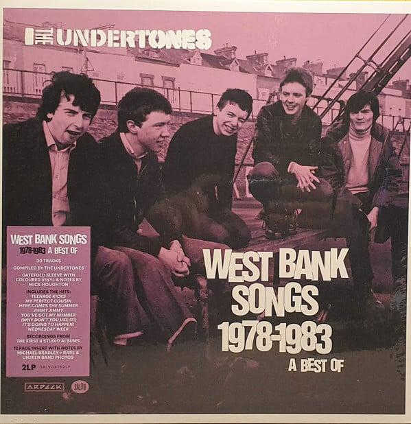

<!-- section break -->

1. You've Got My Number (Why Don't You Use It!) (2:37)
2. Male Model (1:53)
3. Hypnotised (2:29)
4. Billy's Third (1:57)
5. The Way Girls Talk (2:29)
6. True Confessions (1:54)
7. Wednesday Week (2:15)
8. (She's A) Runaround (1:48)
9. There Goes Norman (2:24)
10. Teenage Kicks  (2:25)
11. Tearproof (2:18)
12. Jump Boys (2:41)
13. The Love Parade (3:25)
14. Soul Seven (2:32)
15. Girls Don't Like It (2:17)
16. You're Welcome (2:44)
17. Listening In (2:24)
18. Jimmy Jimmy (2:42)
19. When Saturday Comes (2:51)
20. Julie Ocean (3:34)
21. My Perfect Cousin (2:35)
22. Family Entertainment (2:37)
23. Beautiful Friend (3:24)
24. I Know A Girl (2:35)
25. Get Over You (Kevin Shields Remix 2016) (3:01)
26. Girls That Don't Talk (2:24)
27. Forever Paradise (3:03)
28. Here Comes The Summer (1:45)
29. It's Going To Happen (3:32)
30. Bittersweet (5:08)

<!-- section break -->

## Videos
### Teenage Kicks
 

## Release Information
|  Key           | Value                                                |
| ---------------| ---------------------------------------------------- |
| Release Year   | 2020                                   |
| Discogs Link   | [The Undertones - West Bank Songs 1978-1983 (A Best Of)](https://www.discogs.com/release/14843180-The-Undertones-West-Bank-Songs-1978-1983-A-Best-Of) |
| Label          | BMG |
| Format         | Vinyl LP (Purple Transparent), Vinyl LP (White), All Media Compilation Limited Edition |
| Catalog Number | SALVO426DLP |
| Notes | Gatefold Sleeve. Includes 12 page insert with archive photos, notes and production credits.  50 copies signed by original members of the band still in the current line-up were available as a pre-order from band's website. |