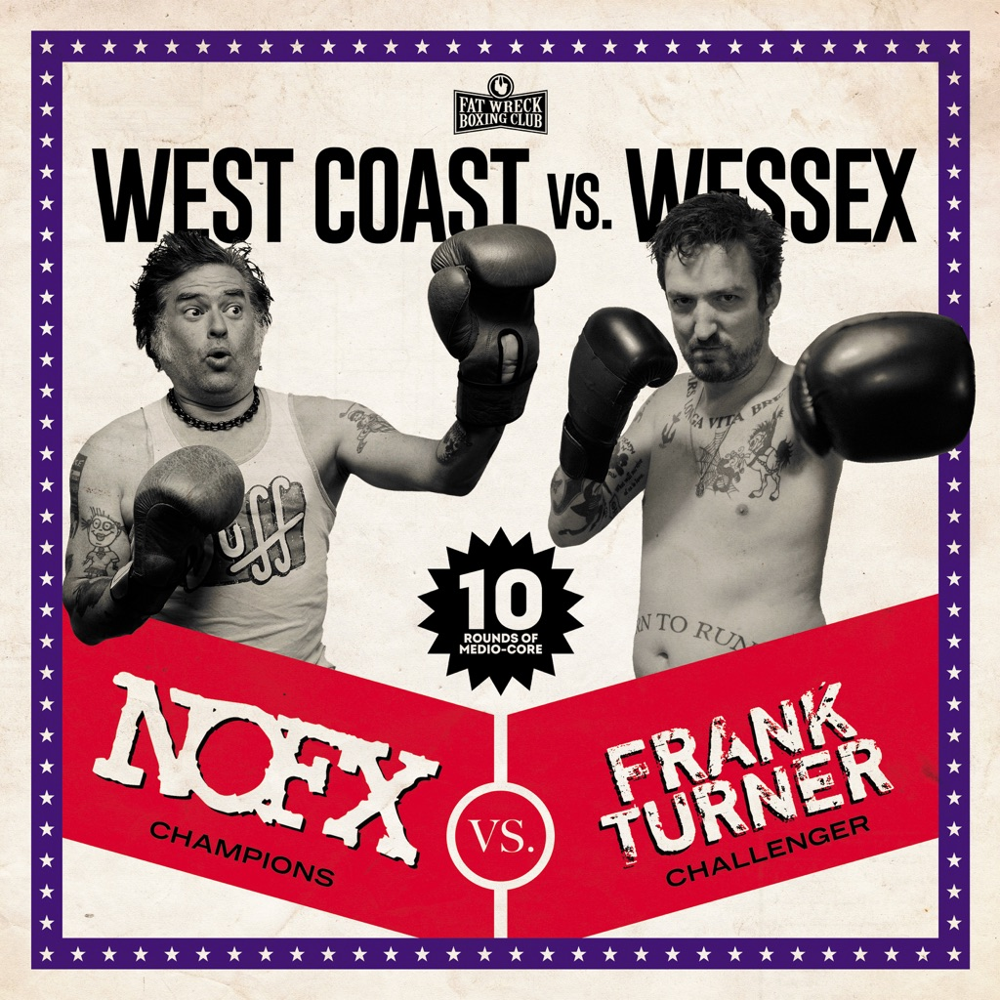

<!-- section break -->

1. Substitute
2. Worse Things Happen At Sea
3. Thatcher Fucked The Kids
4. Ballad Of Me And My Friends
5. Glory Hallelujah
6. Scavenger Type
7. Bob
8. Eat The Meek
9. Perfect Government
10. Falling In Love

<!-- section break -->

## Spotify


## Videos
### Ballad of Me and My Friends
 

### More Videos

- [Eat the Meek](https://www.youtube.com/watch?v=Qiaaf0D3PoM)
- [Scavenger Type](https://www.youtube.com/watch?v=CzNNPAPbGp0)
- [NOFX - Worse Things Happen at Sea (Frank Turner Cover) Official Audio](https://www.youtube.com/watch?v=XRJNeujU6ok)
- [NOFX - Glory Hallelujah (Frank Turner Cover) Official Audio](https://www.youtube.com/watch?v=pm_I2c_PHYU)

## Release Information
|  Key           | Value                                                |
| ---------------| ---------------------------------------------------- |
| Release Year   | 2020                                   |
| Discogs Link   | [NOFX - West Coast Vs. Wessex](https://www.discogs.com/release/15699574-NOFX-Vs-Frank-Turner-West-Coast-Vs-Wessex) |
| Label          | Fat Wreck Chords |
| Format         | Vinyl LP 45 RPM Album |
| Catalog Number | FAT137-1 |
| Notes | Regular black vinyl version.  Publishers: A1 to A5: Pure Groove Music Ltd / Universal B1 to B3, B5: NOFX Music / BMI B4: Four Hour Hell / EMI / Virgin Music  Runouts are etched. |