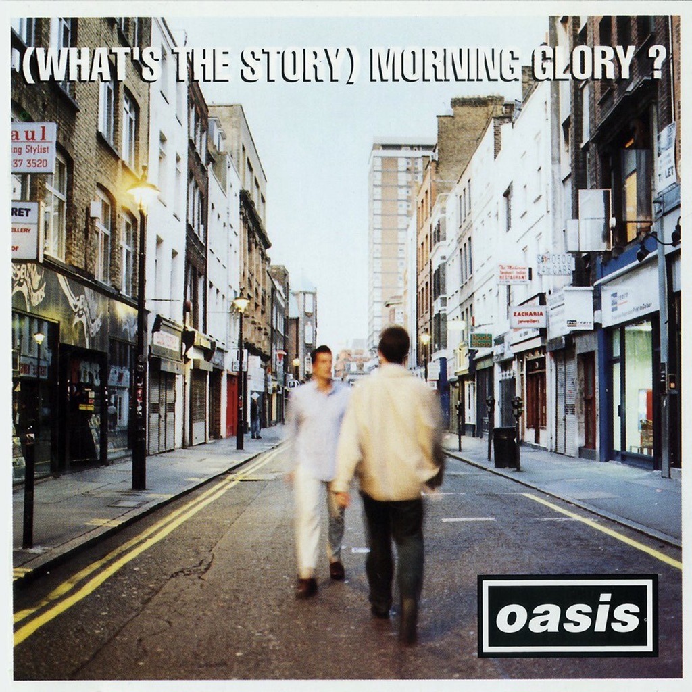

<!-- section break -->

1. Hello (3:21)
2. Roll With It (3:59)
3. Wonderwall (4:18)
4. Don't Look Back In Anger (4:48)
5. Hey Now! (5:41)
6. Untitled (0:44)
7. Bonehead's Bank Holiday (4:03)
8. Some Might Say (5:29)
9. Cast No Shadow (4:51)
10. She's Electric (3:40)
11. Morning Glory (5:03)
12. Untitled (0:39)
13. Champagne Supernova (7:27)

<!-- section break -->

## Videos
### O̲a̲sis - (W̲hat's t̲he S̲t̲ory) M̲o̲rning G̲l̲ory? (Full Album)
 

### More Videos

- [Oasis - Morning Glory (Official HD Remastered Video)](https://www.youtube.com/watch?v=Wm54XyLwBAk)

## Release Information
|  Key           | Value                                                |
| ---------------| ---------------------------------------------------- |
| Release Year   | 2014                                   |
| Discogs Link   | [Oasis - (What's The Story) Morning Glory?](https://www.discogs.com/release/6127871-Oasis-Whats-The-Story-Morning-Glory) |
| Label          | Big Brother |
| Format         | Vinyl 2× LP Album Reissue Remastered |
| Catalog Number | RKIDLP73 |
| Notes | In multifold cover and plain, black, heavy gloss inner sleeves.  Sticker: "Remastered double heavyweight vinyl - includes download code for album, bonus unreleased tracks & rarities" Remastered from original tapes by Ian Cooper at London’s Metropolis Studios. Supervised by the album producer Owen Morris.  All songs written by Noel Gallagher (Dead Leg/Sony/ATV Music Publishing Ltd) except 'Hello' excerpt taken from 'Hello, Hello I'm Back Again' written by Gary Glitter and Mike Leander (Universal/MCA Music Ltd)  Cast No Shadow is dedicated to the genius of Richard Ashcroft Paul Weller appears courtesy of Go! Discs  Track B2 titled "Hey Now" on label.  ℗ & © 2014 Big Brother Recordings Ltd. |