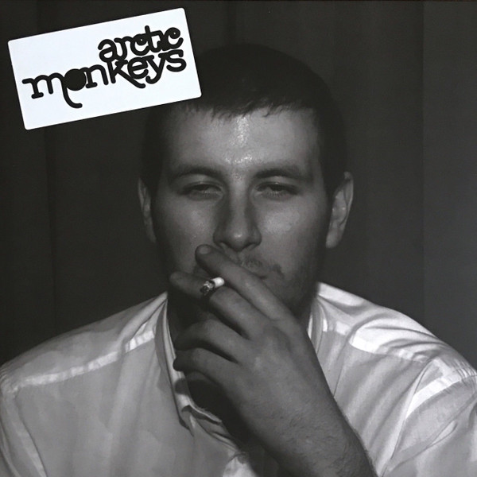

<!-- section break -->

1. The View From The Afternoon
2. I Bet You Look Good On The Dancefloor
3. Fake Tales Of San Francisco
4. Dancing Shoes
5. You Probably Couldn't See For The Lights But You Were Staring Straight At Me
6. Still Take You Home
7. Riot Van
8. Red Light Indicates Doors Are Secured
9. Mardy Bum
10. Perhaps Vampires Is A Bit Strong But..
11. When The Sun Goes Down
12. From The Ritz To The Rubble
13. A Certain Romance

<!-- section break -->

## Spotify


## Videos
### A Certain Romance
 

### More Videos

- [Arctic Monkeys - I Bet You Look Good On The Dancefloor (Official Video)](https://www.youtube.com/watch?v=pK7egZaT3hs)
- [Arctic Monkeys - The View From The Afternoon (Official Video)](https://www.youtube.com/watch?v=PeQAZsyucbQ)
- [Arctic Monkeys - When The Sun Goes Down (Official Video)](https://www.youtube.com/watch?v=EqkBRVukQmE)
- [I Bet You Look Good On The Dancefloor](https://www.youtube.com/watch?v=CYpn8yUnX_c)
- [Fake Tales Of San Francisco](https://www.youtube.com/watch?v=rMIGONn-Gxk)
- [Dancing Shoes](https://www.youtube.com/watch?v=25xNOeXvQLY)
- [You Probably Couldn't See For The Lights But You Were Staring Straight At Me](https://www.youtube.com/watch?v=cfetybygLkk)
- [Riot Van](https://www.youtube.com/watch?v=a62FZZa3fjE)
- [Red Light Indicates Doors Are Secured](https://www.youtube.com/watch?v=u8PjGQLO9mI)
- [Mardy Bum](https://www.youtube.com/watch?v=dO368WjwyFs)
- [Perhaps Vampires Is A Bit Strong But…](https://www.youtube.com/watch?v=53y82WWjea0)
- [From The Ritz To The Rubble](https://www.youtube.com/watch?v=H8bNHRVwzyA)

## Release Information
|  Key           | Value                                                |
| ---------------| ---------------------------------------------------- |
| Release Year   | 2018                                   |
| Discogs Link   | [Arctic Monkeys - Whatever People Say I Am, That's What I'm Not](https://www.discogs.com/release/11826116-Arctic-Monkeys-Whatever-People-Say-I-Am-Thats-What-Im-Not) |
| Label          | Domino |
| Format         | Vinyl LP Album Club Edition Reissue (Gray Translucent w/ Black Smoke, 180 g) |
| Catalog Number | WIGLP162VMP |
| Notes | Sticker: VMP Exclusive Vinyl Edition 1LP 180g Multi-color "Smoke" vinyl 16pg Full-color Lyric & Photo Booklet  Includes a obi strip with a cocktail recipe, and an art print.  ℗ 2006 © 2018 Domino Recording Co. Ltd. PO Box 47029 London, SW18 1WD 20 Jay Street, Suite 626, Brooklyn NY 11201  Recorded at The Chapel Studio, Lincolnshire and 2 Fly Studio, Sheffield. 'Mardy Bum' recorded at Telstar Studios, Munich Mixed [...] at Olympic Studios, London [...] |