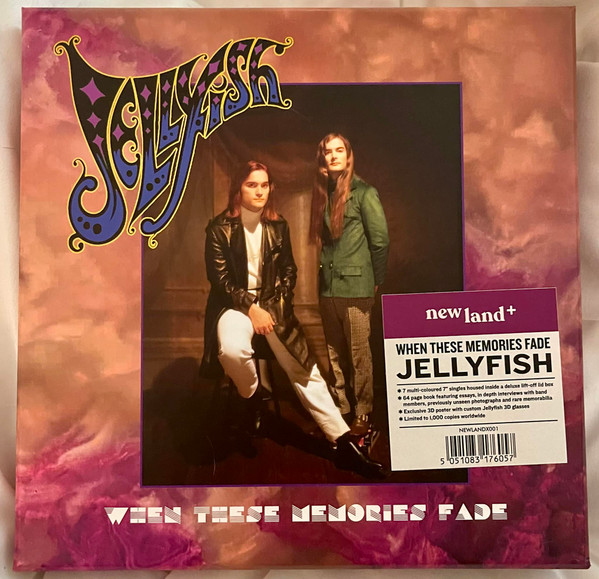

<!-- section break -->

1. The King Is Half-Undressed
2. The King Is Half-Undressed
3. Calling Sarah
4. Baby's Coming Back
5. Baby's Coming Back
6. All I Want Is Everything
7. The Scary-Go-Round E.P. Featuring Now She Knows She's Wrong
8. Now She Knows She's Wrong
9. Bedspring Kiss
10. She Still Loves Him (Live)
11. Baby's Coming Back (Live)
12. I Wanna Stay Home
13. I Wanna Stay Home
14. Jet (Live)
15. The Ghost At Number One
16. The Ghost At Number One
17. All Is Forgiven
18. New Mistake
19. New Mistake
20. He's My Best Friend
21. Covers
22. No Matter What (Live)
23. Think About Your Troubles

<!-- section break -->

## Videos
### Jellyfish - When These Memories Fade [7 Singles Box Set] - Trailer
 

## Release Information
|  Key           | Value                                                |
| ---------------| ---------------------------------------------------- |
| Release Year   | 2022                                   |
| Discogs Link   | [Jellyfish - When These Memories Fade](https://www.discogs.com/release/24641348-Jellyfish-When-These-Memories-Fade) |
| Label          | New Land + |
| Format         | Box Set Compilation Limited Edition Remastered Stereo, Vinyl 7" 45 RPM Single Reissue (Purple), Vinyl 7" 45 RPM Single Reissue (Cream), Vinyl 7" 33 ⅓ RPM EP Reissue (Cerise Pink), Vinyl 7" 45 RPM Single Reissue (Beige), Vinyl 7" 45 RPM Single Reissue (Blue), Vinyl 7" 45 RPM Single Reissue (Baby Pink), Vinyl 7" 45 RPM Single (Salmon Pink) |
| Catalog Number | NEWLANDX001 |
| Notes | 7 record box set features all 6 of Jellyfish's UK singles, pulled from the two albums – 1990’s Bellybutton and 1993’s Spilt Milk, including the 4-track ‘Scary-Go-Round’ EP,  all pressed on 'multi-coloured' 7" vinyl.   Also included is a unique bonus disc featuring two covers, one of which is ‘Think About Your Troubles’, a tribute to Harry Nilsson, recorded by Roger Manning Jr and Andy Sturmer in February 1994, a few weeks after Nilsson’s death (“it was the last thing Jellyfish did as a group”, Roger recalls).  The audio has all been remastered especially for vinyl and as well as the singles in picture sleeves, the set includes a 64-page book with very detailed and entertaining track-by-track guides (not the same as those in the 2015 Omnivore CDs) from Roger Manning Jr, Jason Falkner, Chris Manning, Tim Smith, Eric Dover and band members and a newly written essay by Maura K. Johnston.   The [68 pages including the cover] soft-back book is packed with previously unseen photographs, rare memorabilia and promotional items, plus a 3D poster & Jellyfish branded 3D glasses.  Limited to 1,000 units worldwide and is a one-time pressing (A black vinyl edition was later released on 28th October 2022).  All seven records are in picture sleeves with die-cut white paper inner sleeves. All seven records have 'artwork' Side B labels, with track information on Side A labels [Side A (This Side) / Side B (Other Side)]  Live tracks are denoted with an asterisk on the rear of the box as " * Live tracks " |