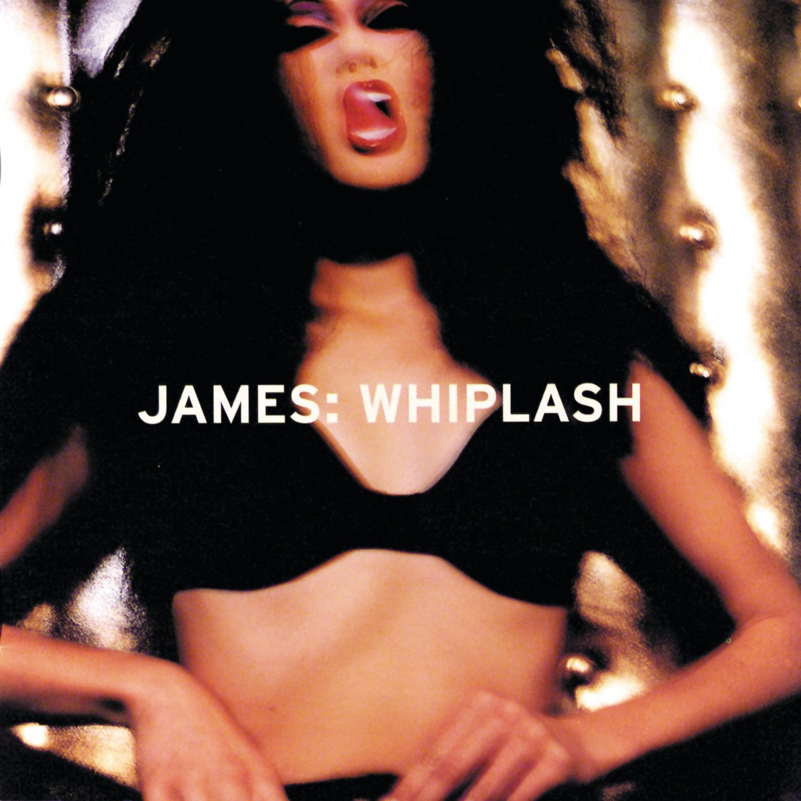

<!-- section break -->

1. Tomorrow (3:46)
2. Lost A Friend (3:40)
3. Waltzing Along (3:54)
4. She's A Star (3:39)
5. Greenpeace (4:49)
6. Go To The Bank (4:22)
7. Play Dead (4:44)
8. Avalanche (3:46)
9. Homeboy (2:38)
10. Watering Hole (3:45)
11. Blue Pastures (4:18)

<!-- section break -->

## Spotify


## Videos
### James - Tomorrow
 

### More Videos

- [James - Lost A Friend Live (VH-1 1998)](https://www.youtube.com/watch?v=hsxrfv2zVPc)
- [James - Waltzing Along](https://www.youtube.com/watch?v=QZTCt-nQY9U)
- [James - She's a star (HQ) (Whiplash 1997)](https://www.youtube.com/watch?v=VF2qV-oSn0Q)

## Release Information
|  Key           | Value                                                |
| ---------------| ---------------------------------------------------- |
| Release Year   | 2017                                   |
| Discogs Link   | [James - Whiplash](https://www.discogs.com/release/11285438-James-Whiplash) |
| Label          | Fontana |
| Format         | Vinyl 2× LP Album Reissue |
| Catalog Number | 5712913 |
