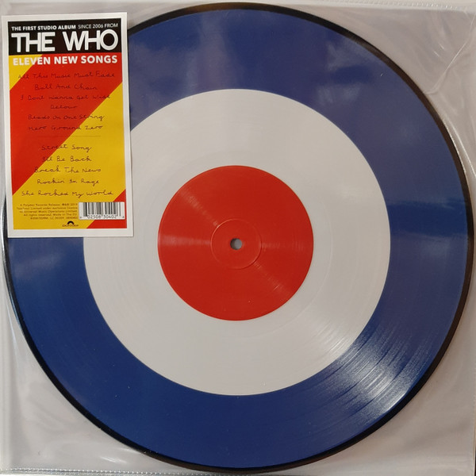

<!-- section break -->

1. All This Music Must Fade
2. Ball And Chain
3. I Don't Wanna Get Wise
4. Detour
5. Beads On One String
6. Hero Ground Zero
7. Street Song
8. I'll Be Back
9. Break The News
10. Rockin' In Rage
11. She Rocked My World

<!-- section break -->

## Spotify


## Release Information
|  Key           | Value                                                |
| ---------------| ---------------------------------------------------- |
| Release Year   | 2019                                   |
| Discogs Link   | [The Who - Who](https://www.discogs.com/release/14492295-The-Who-Who) |
| Label          | Polydor |
| Format         | Vinyl LP Album Limited Edition Picture Disc |
| Catalog Number | 0830402 |
| Notes | The First Studio Album since 2006  Includes free digital download code of all songs of "Who"  ℗&© 2019 Yearhour Limited under exclusive licence to Universal Music Operations Limited  Made in the EU  |