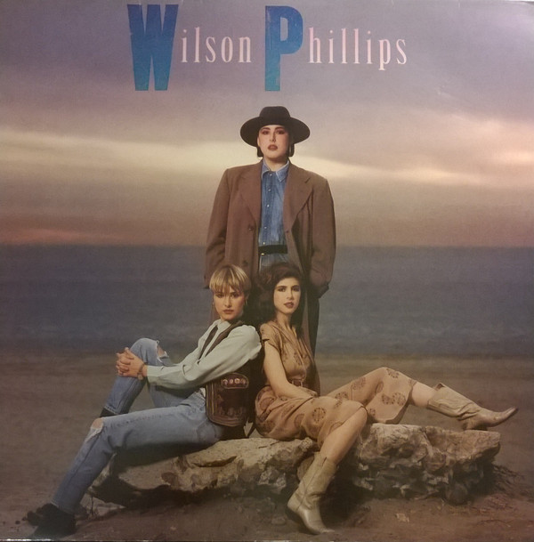

<!-- section break -->

1. Hold On (4:27)
2. Release Me (4:56)
3. Impulsive (4:34)
4. Next To You (Someday I'll Be) (4:55)
5. You're In Love (4:50)
6. Over And Over (4:35)
7. A Reason To Believe (4:02)
8. Ooh You're Gold (4:13)
9. Eyes Like Twins (5:00)
10. The Dream Is Still Alive (4:11)

<!-- section break -->

## Spotify


## Videos
### The Dream is still Alive Wilson Phillips 1990 - Video
 

### More Videos

- [wilson phillips - release me with lyrics](https://www.youtube.com/watch?v=dSKZy2Knk94)
- [Impulsive](https://www.youtube.com/watch?v=9MF9e-KKhfY)
- [Wilson Phillips - Hold On (Official Music Video)](https://www.youtube.com/watch?v=uIbXvaE39wM)
- [You're In Love](https://www.youtube.com/watch?v=IlnWKfd7Cgo)
- [Hold On](https://www.youtube.com/watch?v=1SNGwgGoBVg)
- [Someday I'll Be Next To You (with lyrics)](https://www.youtube.com/watch?v=KfzOmiezrf8)
- [Release Me Wilson Phillips 1990 - Video](https://www.youtube.com/watch?v=gcNyk54b3ZU)
- [Wilson Phillips - 'You're in Love' 1990](https://www.youtube.com/watch?v=_mpS1Dw_4VY)
- [Wilson Phillips Ooh You're Gold](https://www.youtube.com/watch?v=Bws57fSYvm8)
- [Next to You | Wilson Phillips](https://www.youtube.com/watch?v=wazM0gGFJBw)
- [Wilson Phillips - Over and Over](https://www.youtube.com/watch?v=8cbSZdCzf2c)
- [Ooh You're Gold](https://www.youtube.com/watch?v=evDT6xHJyr4)
- [You're In Love - Wilson Phillips w/lyrics](https://www.youtube.com/watch?v=FSXMxh181Mw)
- [Wilson Phillips - Reason to Believe](https://www.youtube.com/watch?v=HoqCYBQKcp0)
- [The Dream Is Still Alive](https://www.youtube.com/watch?v=8I8REwOQq_Q)
- [THE DREAM IS STILL ALIVE | Wilson Phillips](https://www.youtube.com/watch?v=lg7WSzWAsVQ)
- [Eyes Like Twins-Wilson Phillips](https://www.youtube.com/watch?v=AnSPKXfomKI)

## Release Information
|  Key           | Value                                                |
| ---------------| ---------------------------------------------------- |
| Release Year   | 1990                                   |
| Discogs Link   | [Wilson Phillips - Wilson Phillips](https://www.discogs.com/release/7423483-Wilson-Phillips-Wilson-Phillips) |
| Label          | SBK Records |
| Format         | Vinyl LP Album |
| Catalog Number | SBKLP 5 |
| Notes | Printed in England Manufactured in England SP9006JU.  Different information on bottom left side of reverse sleeve to [r348854] |