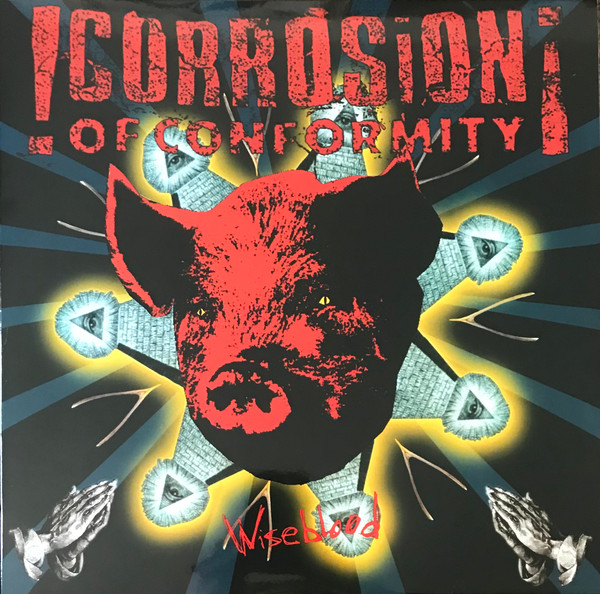

<!-- section break -->

1. King Of The Rotten
2. Long Whip / Big America
3. Wiseblood
4. Goodbye Windows
5. Born Again For The Last Time
6. Drowning In A Daydream
7. The Snake Has No Head
8. The Door
9. Man Or Ash
10. Redemption City
11. Wishbone (Some Tomorrow)
12. Fuel
13. Bottom Feeder (El Que Come Abajo) (Instrumental)

<!-- section break -->

## Spotify


## Videos
### Corrosion Of Conformity - Drowning In a Daydream
 

### More Videos

- [CORROSION OF CONFORMITY- Wiseblood 2X Vinyl (Full Album) HD](https://www.youtube.com/watch?v=ENhk9xq1fA4)

## Release Information
|  Key           | Value                                                |
| ---------------| ---------------------------------------------------- |
| Release Year   | 2020                                   |
| Discogs Link   | [Corrosion Of Conformity - Wiseblood](https://www.discogs.com/release/15680001-Corrosion-Of-Conformity-Wiseblood) |
| Label          | Music On Vinyl |
| Format         | Vinyl 2× LP Album Limited Edition Numbered Reissue Stereo (Blue & Red Marbled Translucent, 180 Gram) |
| Catalog Number | MOVLP753 |
| Notes | Originally released ℗ & © 1996 Sony Music Entertainment. This release ℗ & © 2013 Sony Music Entertainment. Comes with printed inner sleeves containing lyrics and credits. 1000 copies pressed. Track B2 "Drowning In A Daydream" mixed at [l276645]. |