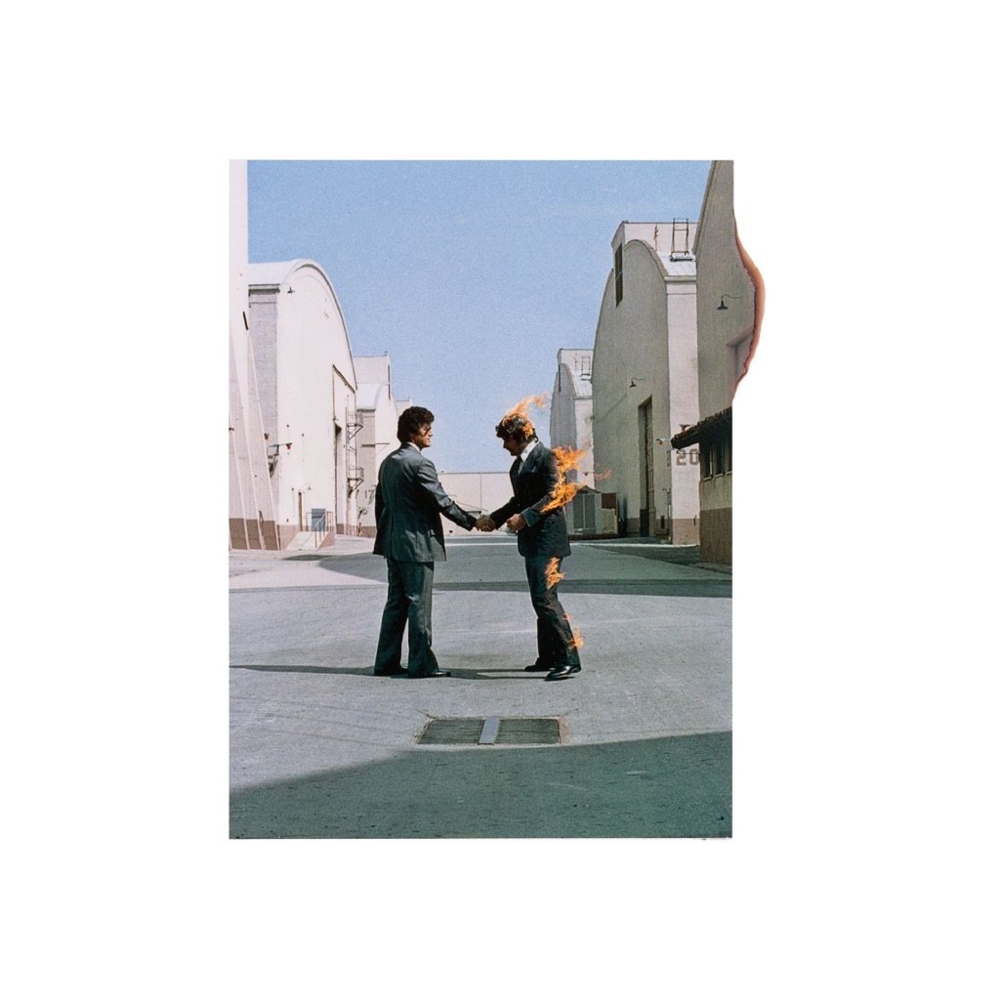

<!-- section break -->

1. Shine On You Crazy Diamond (1 - 5)
2. Welcome To The Machine
3. Have A Cigar
4. Wish You Were Here
5. Shine On You Crazy Diamond (6 - 9)

<!-- section break -->

## Spotify


## Release Information
|  Key           | Value                                                |
| ---------------| ---------------------------------------------------- |
| Release Year   | 2016                                   |
| Discogs Link   | [Pink Floyd - Wish You Were Here](https://www.discogs.com/release/9180570-Pink-Floyd-Wish-You-Were-Here) |
| Label          | Pink Floyd Records |
| Format         | Vinyl LP Album Reissue Remastered Stereo (180g) |
| Catalog Number | PFRLP9 |
| Notes | Almost identical to [r=25885156] but this edition does NOT show the cat# number on the lower right side of the inner sleeve.  The stereo remastered album on Heavyweight 180 Vinyl Remastered from the original analogue tapes by JAMES GUTHRIE, JOEL PLANTE and BERNIE GRUNDMAN Original UK release date: September 1975 Made in the E.U. www.pinkfloyd.com  Comes with printed inner sleeve, postcard and download code card. The album is concealed in black shrink-wrap (making the front cover art "absent"). On the front of the shrinkwrap is a George Hardie designed sticker depicting two mechanical hands engaged in a handshake.  ℗ & © 2016 Pink Floyd Music Ltd.  Runouts: - Runouts are etched. - The following [l313190] geometric marks in runouts are mirrored: '51' and '=4' (variant 1), '15=Λ' and '+I ̶L̶ ' (variant 3), '12=X' (variant 4), '17+T' and 'IhI' (variant 5), and '17=' & '11I' (variant 6). See 'Notes on Vinyl records' section on [l313190] page. |