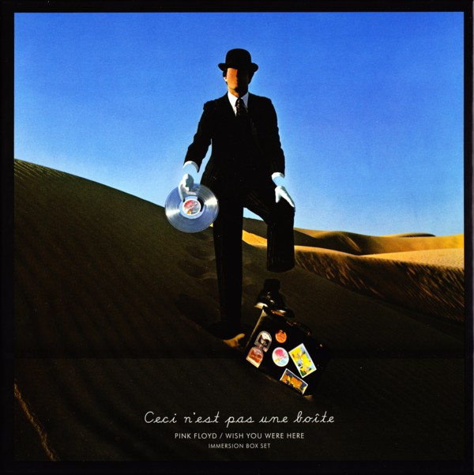

<!-- section break -->

1. The Original Album, Remastered In 2011 (44:18)
2. Shine On You Crazy Diamond (Parts 1-5) (13:32)
3. Welcome To The Machine (7:31)
4. Have A Cigar (5:07)
5. Wish You Were Here (5:34)
6. Shine On You Crazy Diamond (Parts 6-9) (12:29)
7. Unreleased Audio Tracks (66:54)
8. Shine On You Crazy Diamond (Live At Wembley 1974) (20:22)
9. Raving And Drooling (Live At Wembley 1974) (12:35)
10. You've Got To Be Crazy (Live At Wembley 1974) (18:12)
11. Wine Glasses (From The 'Household Objects' Project) (2:16)
12. Have A Cigar (Alternative Version) (7:11)
13. Wish You Were Here (With Stéphane Grappelli) (6:13)
14. Wish You Were Here Multi-Channel Audio Mixes
15. 5.1 Surround Mix (2009) 448kbps
16. Shine On You Crazy Diamond (Parts 1-5) (13:33)
17. Welcome To The Machine (7:37)
18. Have A Cigar (5:12)
19. Wish You Were Here (5:39)
20. Shine On You Crazy Diamond (Parts 6-9) (12:48)
21. 5.1 Surround Mix (2009) 640kbps
22. Shine On You Crazy Diamond (Parts 1-5) (13:33)
23. Welcome To The Machine (7:37)
24. Have A Cigar (5:12)
25. Wish You Were Here (5:39)
26. Shine On You Crazy Diamond (Parts 6-9) (12:48)
27. LPCM Original Stereo Mix (1975)
28. Shine On You Crazy Diamond (Parts 1-5) (13:33)
29. Welcome To The Machine (7:37)
30. Have A Cigar (5:12)
31. Wish You Were Here (5:39)
32. Shine On You Crazy Diamond (Parts 6-9) (12:48)
33. 4.0 Quad Mix (1975) 448kbps
34. Shine On You Crazy Diamond (Parts 1-5) (13:33)
35. Welcome To The Machine (7:37)
36. Have A Cigar (5:12)
37. Wish You Were Here (5:39)
38. Shine On You Crazy Diamond (Parts 6-9) (12:48)
39. 4.0 Quad Mix (1975) 640kbps
40. Shine On You Crazy Diamond (Parts 1-5) (13:33)
41. Welcome To The Machine (7:37)
42. Have A Cigar (5:12)
43. Wish You Were Here (5:39)
44. Shine On You Crazy Diamond (Parts 6-9) (12:48)
45. Audio-Visual Material (75:00)
46. Concert Screen Films, 1975 LPCM Stereo 48kHz/24 Bit (20:00)
47. Shine On You Crazy Diamond (Part I) (4:56)
48. Shine On You Crazy Diamond (7:47)
49. Welcome To The Machine (7:41)
50. Storm Thorgerson Short Film, 2000 LPCM Stereo 48kHz/24 Bit (6:00)
51. Storm Thorgerson Short Film, 2000 (6:00)
52. Concert Screen Films, 1975 (5.1 Surround Sound) Dolby Digital @ 448 Kbps (20:00)
53. Shine On You Crazy Diamond (Part I) (4:56)
54. Shine On You Crazy Diamond (7:47)
55. Welcome To The Machine (7:41)
56. High Resolution Audio And Audio - Visual Material
57. Audio
58. 5.1 Surround Mix (2009) 96kHz/24 Bit (44:18)
59. Shine On You Crazy Diamond (Parts 1-5) (13:32)
60. Welcome To The Machine (7:31)
61. Have A Cigar (5:07)
62. Wish You Were Here (5:34)
63. Shine On You Crazy Diamond (Parts 6-9) (12:29)
64. Original Stereo Mix (1975) 96kHz/24 Bit (44:18)
65. Shine On You Crazy Diamond (Parts 1-5) (13:32)
66. Welcome To The Machine (7:31)
67. Have A Cigar (5:07)
68. Wish You Were Here (5:34)
69. Shine On You Crazy Diamond (Parts 6-9) (12:29)
70. 4.0 Quad Mix (1975) 96kHz/24 Bit (44:18)
71. Shine On You Crazy Diamond (Parts 1-5) (13:32)
72. Welcome To The Machine (7:31)
73. Have A Cigar (5:07)
74. Wish You Were Here (5:34)
75. Shine On You Crazy Diamond (Parts 6-9) (12:29)
76. Audio-Visual
77. Concert Screen Films, 1975 LPCM Stereo 48kHz/24 Bit (20:00)
78. Shine On You Crazy Diamond (Part I) (4:56)
79. Shine On You Crazy Diamond (7:47)
80. Welcome To The Machine (7:41)
81. Storm Thorgerson Short Film, 2000 LPCM Stereo 48kHz/16 Bit (6:00)
82. Storm Thorgerson Short Film, 2000 (6:00)
83. Concert Screen Films, 1975 5.1 Surround Sound 48kHz/24 Bit (20:00)
84. Shine On You Crazy Diamond (Intro) (4:56)
85. Shine On You Crazy Diamond (7:47)
86. Welcome To The Machine (7:41)

<!-- section break -->

## Release Information
|  Key           | Value                                                |
| ---------------| ---------------------------------------------------- |
| Release Year   | 2011                                   |
| Discogs Link   | [Pink Floyd - Wish You Were Here - Immersion Box Set](https://www.discogs.com/release/3205416-Pink-Floyd-Wish-You-Were-Here-Immersion-Box-Set) |
| Label          | EMI |
| Format         | CD Album Reissue Remastered Stereo, CD Remastered Stereo, DVD Multichannel NTSC Album Reissue Remastered Stereo Quadraphonic, DVD DVD-Video Multichannel NTSC Stereo, Blu-ray Album Reissue Remastered Stereo Quadraphonic Multichannel, Box Set Limited Edition |
| Catalog Number | 50999 029435 2 7 |
| Notes | Subtitle: "Ceci n'est pas une boîte"  Box set also includes:  a 36-page 27 cm x 27 cm book "Immersion Book" designed by Storm Thorgerson, embossed on front sleeve, including recording informations, song lyrics, sleeve artwork, concert ticket and poster reprints and others,  a 24-page 27 cm x 27 cm photo book " Wish You Were Here - Pink Floyd Circa 1973 - 1975", including photographs By Jill Furmanovsky and Hipgnosis, edited by Jill Furmanovsky,  a 8-page credits booklet, an exclusive 27 cm x 27 cm Art Print "Diver - 1975",  a black envelope "Immersion Collectors' Cards" 15 cm x 11 cm including:  • 4 x "Immersion Collectors' Cards" 8 cm x 11 cm featuring art and comments by Storm Thorgerson with a total of 57 different variations (The Collectors' Cards are a set of obscure Floyd images reminiscent of cigarette cards [but these are anti-cigarette]. They can be found in various Pink Floyd products)  a black envelope "Immersion Memorabilia" 18 cm x 10 cm including:  • a replica of Wish You Were Here tour ticket from 23 Fevrier 1977 Pav. De Paris 7 cm x 16 cm and  • a replica of Wish You Were Here backstage pass 1975 7,8 cm x 10,5 cm,  a collectible printed scarf of 100% viscose 78 cm x 24 cm,  a black cloth sack 8 cm x 9 cm including:  • 3 x collectable clear marbles 2,4 cm round,  9 x collectible coasters 10,2 cm round (unique to this box) featuring early design sketches and a German FSK insert 12 cm x 12 cm.   Discs 1 - 4 are mounted in the box set, disc 5 is in separate card sleeve  No durations given for discs 1, 2, 3 and 5  Digital remaster ℗ 2011 The copyright in this music is owned by Pink Floyd Music Ltd under exclusive licence to EMI Records Ltd. © 2011 Pink Floyd Music Ltd.  Released on 04-11-11 in Europe.  Released on 07-11-11 in the U.K. |