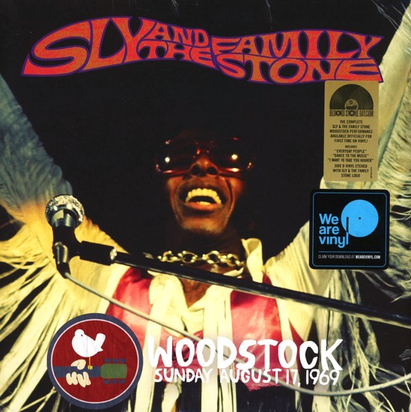

<!-- section break -->

1. M'Lady (7:46)
2. Sing A Simple Song (5:14)
3. You Can Make It If You Try (5:37)
4. Everyday People (3:17)
5. Dance To The Music (4:28)
6. Medley: Music Lover/Higher (7:51)
7.  I Want To Take You Higher (6:43)
8. Love City (6:04)
9. Stand! (3:20)

<!-- section break -->

## Spotify


## Release Information
|  Key           | Value                                                |
| ---------------| ---------------------------------------------------- |
| Release Year   | 2019                                   |
| Discogs Link   | [Sly & The Family Stone - Woodstock Sunday August 17, 1969](https://www.discogs.com/release/13496948-Sly-The-Family-Stone-Woodstock-Sunday-August-17-1969) |
| Label          | Epic |
| Format         | Vinyl LP, Vinyl LP Single Sided Etched, All Media Album Record Store Day Reissue |
| Catalog Number | 19075921541 |
| Notes | Single wide spine sleeve includes an insert and a download-card  Side D etched with Sly & The Family Stone logo  Label rim text: "© 2009, 2019 Epic Records, a division of Sony Music Entertainment / Compilation ℗ Epic Records, a division of Sony Music Entertainment / EPIC is the exclusive trademark of Sony Music Entertainment / All trademarks and logos are protected. / All Rights Reserved. / Made in the EU. / BIEM/GEMA / LC00199  Runouts are hand-etched up to the MPO logo, which together with the subsequent numbers is laser etched. |