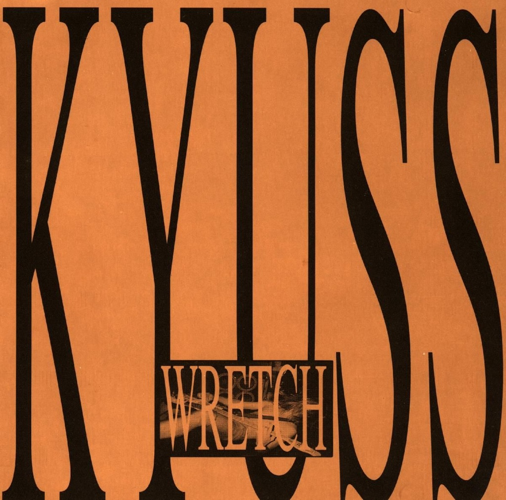

<!-- section break -->

1. Beginning Of What's About To Happen (1:30)
2. Hwy 74 (3:10)
3. Love Has Passed Me By (3:10)
4. Son Of A Bitch (6:00)
5. Black Widow (2:40)
6. Katzenjammer (2:20)
7. Deadly Kiss (5:02)
8. The Law (7:50)
9. Isolation (2:45)
10. I'm Not (4:30)
11. Big Bikes (5:04)
12. Stage III (4:05)

<!-- section break -->

## Spotify


## Videos
### Love Has Passed Me By
 

### More Videos

- [[Beginning of What's About to Happen] Hwy 74](https://www.youtube.com/watch?v=qDnoe3IP1Pk)
- [Son of a Bitch](https://www.youtube.com/watch?v=IdwEH2se_p0)
- [Black Widow](https://www.youtube.com/watch?v=lD6lekY7eSk)
- [Katzenjammer](https://www.youtube.com/watch?v=svWijD-TWrs)
- [Deadly Kiss](https://www.youtube.com/watch?v=52ZJOcQg29o)
- [The Law](https://www.youtube.com/watch?v=NMXjKDXWrm8)
- [Isolation](https://www.youtube.com/watch?v=fvWKp5-XHrA)
- [I'm Not](https://www.youtube.com/watch?v=0vlf4z-EMpQ)
- [Big Bikes](https://www.youtube.com/watch?v=RwpWyGPk4k0)
- [Stage III](https://www.youtube.com/watch?v=FD6iMtFyclU)

## Release Information
|  Key           | Value                                                |
| ---------------| ---------------------------------------------------- |
| Release Year   | 2016                                   |
| Discogs Link   | [Kyuss - Wretch](https://www.discogs.com/release/8964385-Kyuss-Wretch) |
| Label          | Dali Records |
| Format         | Vinyl 2× LP Album Reissue Repress (White / Grey Marbled, 180 Gram) |
| Catalog Number | 3704-61256-1 |
| Notes | Sticker on front sleeve stating "180g Coloured Vinyl".  Recorded and mixed at Headway Studios and Master Control. Mastered at K-Disk.  Originally released as a [url=http://www.discogs.com/Kyuss-Wretch/release/2885461] single LP[/url] on black vinyl in 1991 by Dali Records.  ℗ & © 1991 Dali Records, a division of Chamelion Music Group. Made in Germany  Pressing plant uncredited, identified by the matrix numbers.   |