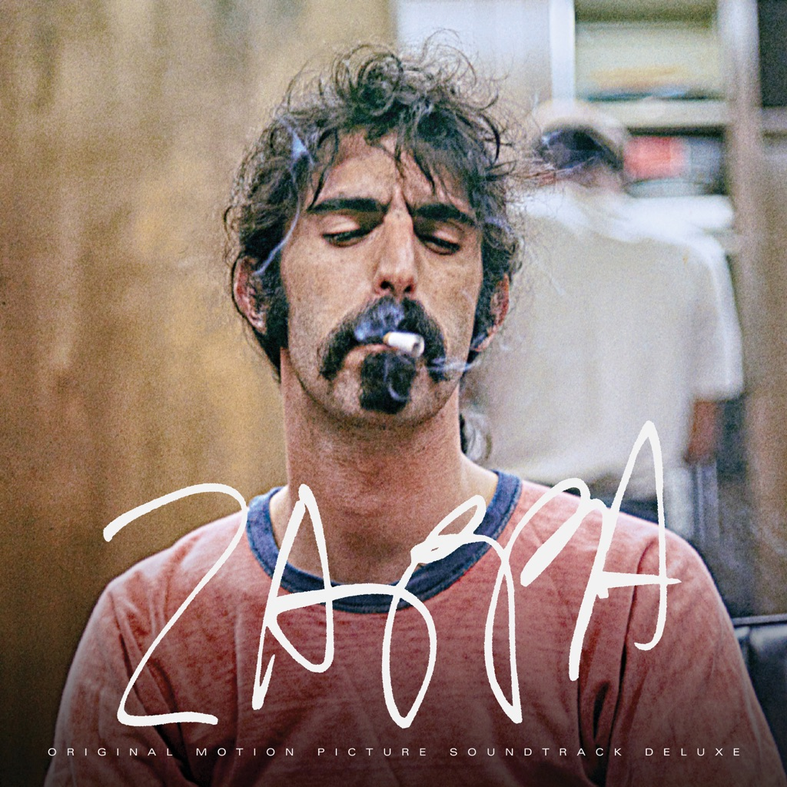

<!-- section break -->

1. Motherly Love (2:43)
2. Memories Of El Monte (4:14)
3. Oh! In The Sky (1:56)
4. The Duke (6:31)
5. How Could I Be Such A Fool? (1:49)
6. Absolutely Free (3:27)
7. Call Any Vegetable (Excerpts) (4:24)
8. Road Ladies (4:10)
9. Cheepnis (3:19)
10. Apostrophe’ (6:08)
11. Sofa (2:57)
12. The Black Page #1 (Piano Version)   (2:13)
13. Mo’s Vacation (4:03)
14. Dancin’ Fool (3:50)
15. Valley Girl (4:51)
16. The Meek Shall Inherit Nothing (3:06)
17. H.R. 2911 (3:34)
18. Envelopes (1983 Original Vinyl Mix)  (4:05)
19. Get Whitey  (6:31)
20. G-Spot Tornado (4:00)
21. Watermelon In Easter Hay (Live)  (6:07)

<!-- section break -->

## Spotify


## Release Information
|  Key           | Value                                                |
| ---------------| ---------------------------------------------------- |
| Release Year   | 2021                                   |
| Discogs Link   | [Frank Zappa - Zappa (Original Motion Picture Soundtrack)](https://www.discogs.com/release/18681091-Frank-Zappa-Zappa-Original-Motion-Picture-Soundtrack) |
| Label          | Zappa Records |
| Format         | Vinyl 2× LP Album (180g, Crystal Clear) |
| Catalog Number | ZR20035-1C |
| Notes | gatefold cover  A1: From the album: [r=537392] (1996); 1987 Digital Remaster; © 1966 ℗ 1987 A2 to A4: Recorded live at the Whisky a Go Go 6/23/1968; Source: 1'' 8-Track Analog Tape;  A2: © 1963 ℗ 2020; Publisher: Lovolar Music (BMI) A3: © 2012 ℗ 2020 A4: © 1969 ℗ 2020  A5: From the album: Mystery Disc (1985); First released in [r=2692688] (1985); © 1966 ℗ 1985 A6: From the album: [r=1178766] (1968); FZ Approved Master: 1993; © 1968 ℗ 1995  B1: Taken from the VPRO Documentary, 1971; Recorded live at Fillmore West, 11/06/1970; © 1967 ℗ 2020 B2: From the album: [r=4126341] (1970); Remastered by Bob Ludwig, Gateway Mastering, 2012; © 1970 ℗ 2012 B3: From the album: [r=11757353] (2018); © 1974 ℗ 2018 B4: Recorded live in Los Angeles, Rehearsal Hall, 6/21/1974; Source: 2'' 16-Track Analog Tape; © 1974 ℗ 2020 B5: From the album: [r=13416770] (2019); © 1975 ℗ 2019  C1: From the album: [r=13416770] (2019); © 1977 ℗ 2019 C2: Recorded live at Circus Krone, Munich Germany, 8/31/1978, Recorded by Bayerische Rundfunk; Source: 1/4'' 2-Track Analog Tape; ©℗ 2020 C3: Recorded live at NBC Studios, Saturday Night Live, 10/21/1978; © 1979; ℗ 2020 Universal Television, LLC C4: From the album: [r=1468461] (1982); ©℗ 1982 C5: Recorded live at The Pier, NYC, 8/25/1984; © 1981 ℗ 2020 C6: From the album: [r=1535353] (1985); ©℗ 1985  D1: From the album: [r=7383913] (1983); Original 1983 Vinyl Mix, Digitally Remastered by Bob Stone, 1986; © 1982 ℗ 1986 D2: From the album: [r=748484] (1993); ©℗ 1993 D3: From the album: [r=748484] (1993); © 1986 ℗ 1993 D4: From the album: [r=2027528] (1996); © 1979 ℗ 1996  Sticker on shrinkwrap reads  '180g Crystal Clear Vinyl 2LP Contains highlights from the Original Motion Picture Soundtrack to the acclaimed "Zappa" Documentary by Alex Winter Features unreleased material from The Vault and standout tracks from Zappa's vast catalog, some pressed on vinyl for the first time ever.'  Includes gatefold 4-page insert  Made in Germany |