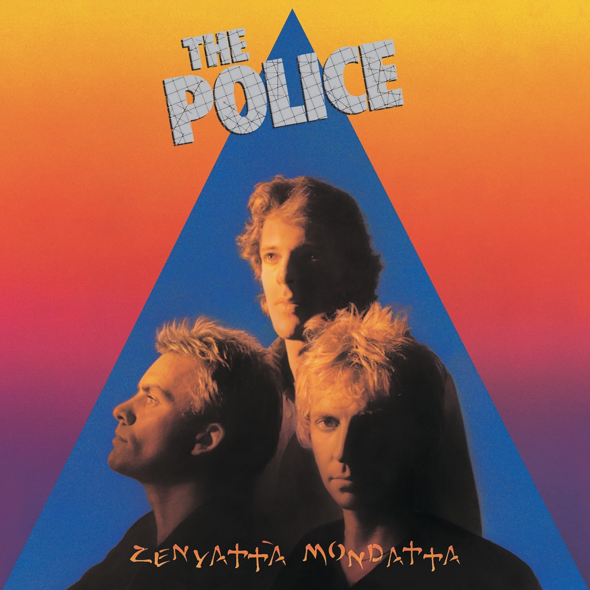

<!-- section break -->

1. Don't Stand So Close To Me (4:03)
2. Driven To Tears (3:21)
3. When The World Is Running Down, You Make The Best Of What's Still Around (3:33)
4. Canary In A Coalmine (2:24)
5. Voices Inside My Head (3:51)
6. Bombs Away (3:07)
7. De Do Do Do, De Da Da Da (4:09)
8. Behind My Camel (2:53)
9. Man In A Suitcase (2:15)
10. Shadows In The Rain (5:09)
11. The Other Way Of Stopping (3:21)

<!-- section break -->

## Spotify


## Release Information
|  Key           | Value                                                |
| ---------------| ---------------------------------------------------- |
| Release Year   | 1980                                   |
| Discogs Link   | [The Police - Zenyatta Mondatta](https://www.discogs.com/release/371546-The-Police-Zenyatta-Mondatta) |
| Label          | A&M Records |
| Format         | Vinyl LP Album Stereo |
| Catalog Number | AMLH 64831 |
| Notes | ℗ 1980 A&M Records Ltd. © 1980 A&M Records Ltd. Original sound recording made by A&M Records Ltd  Recorded at Wisseloord Studios, Hilversum, Netherlands.  Issued with an illustrated picture inner sleeve.  A1 to A5, B1, B3, B4: Virgin Music (Publishers) Ltd A6, B2, B5: Roxanne Music Overseas Ltd  Runouts are etched, except for STRAWBERRY |